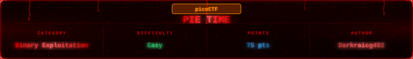

---

## Challenge Overview

> Can you try to get the flag? Beware we have PIE!

The name says it all. This one is about PIE (Position Independent Executable). Unlike Quizploit where PIE was disabled and addresses were fixed, here PIE is enabled. Every time the binary runs it loads at a different base address. You cannot just hardcode `win()` and call it a day. You need to figure out where things actually are at runtime.

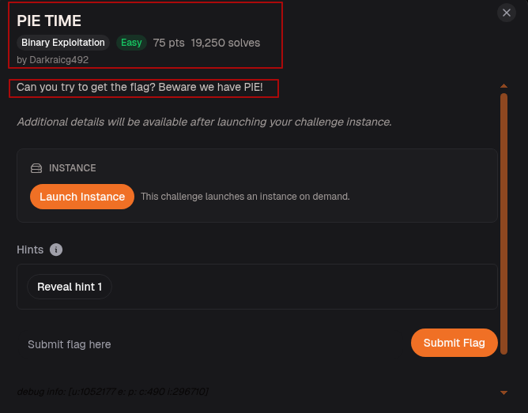

---

## Step-1: Setup

Launched the instance and downloaded the source and binary.

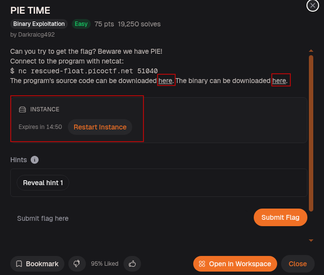

Ran `file` on the binary. It came back as `ELF 64-bit LSB pie executable` the word `pie` right there in the output confirms it. Dynamically linked, not stripped.

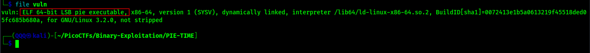

Then `checksec` to see exactly what we are dealing with.

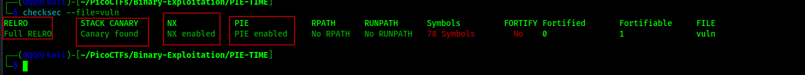

Full RELRO, stack canary found, NX enabled, and PIE enabled. Four protections at once. The canary means we cannot smash the stack blindly. So:
* NX means no shellcode on the stack. 
* PIE means no fixed addresses. 
* And not stripped means function names are still there, and that is what we need!.

---

## Step-2: Reading the Source


The source is where everything clicks. Two things stand out. First, `win()` opens and reads `flag.txt`  that is the target. Second, `main()` prints its own address with `printf("Address of main: %p\n", &main)` and then asks you to enter an address to jump to via `scanf("%lx", &val)`.

The binary is handing you a runtime address. If you know the offset between `main` and `win`, you can calculate exactly where `win` is every single run, no matter where PIE loads the binary.

---

## Step-3: Running It for the First Time

Made the binary executable and ran it.

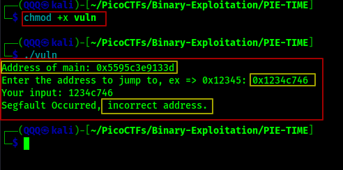


It prints `main`s address and waits. We gave it a random address and got `Segfault Occurred, incorrect address.`  exactly what `segfault_handler` does when the jump fails. Now we know the flow. We just need the right address.

---

## Step-4: Finding the Offset in GDB

We loaded the binary in GDB. Since PIE is enabled the addresses change every run, but the offset between `main` and `win` is fixed at compile time. That is the number we need.

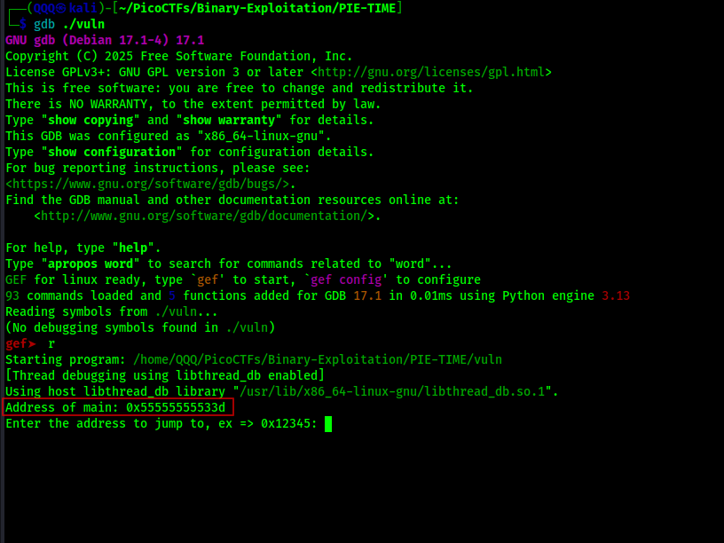

GDB leaked `main`s address on startup. We ran the binary and it printed `Address of main: 0x55555555533d`.

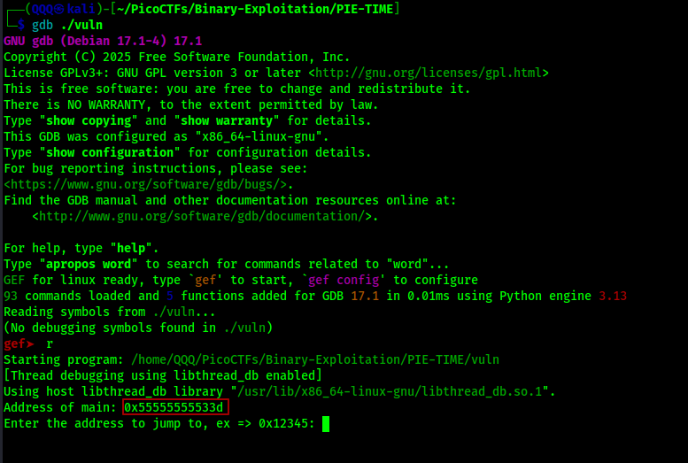

Then we asked GDB for `win`s address directly.

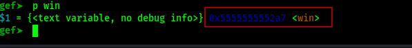

`win` is at `0x5555555552a7`. Now we have both. We used our subtraction script to calculate the offset cleanly.

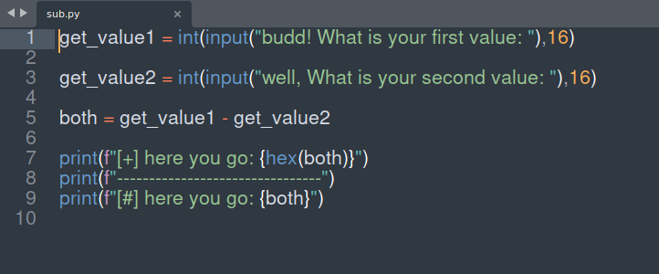

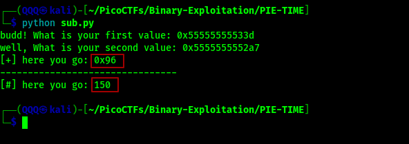

Then confirmed it inside GDB by calculating `&main - &win` directly.

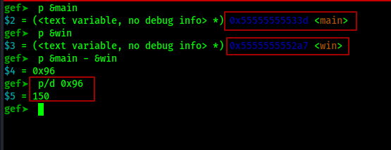

`0x96` in hex, which is 150 in decimal. `win` always sits 150 bytes before `main`. The formula is locked: `win = leaked_main - 0x96`.

---

## Method 1: Manual via netcat

Wrote a small helper script that takes `main`s leaked address and subtracts 150 to give back `win`s address.

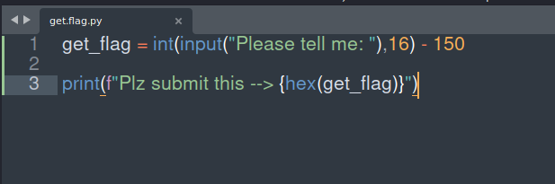

Connected via netcat on one side, ran the helper on the other. Fed in the leaked address, got `win`s address back, submitted it.

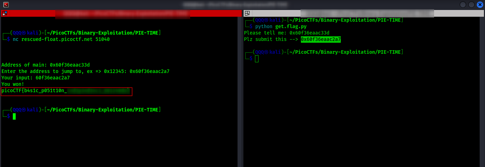

`You won!` printed along with the flag.

---

## Method 2: Automated with pwntools

The cleaner approach. One script handles everything: connects to the remote, receives the leaked `main` address, calculates the base, adds `win`s offset, and sends it back.

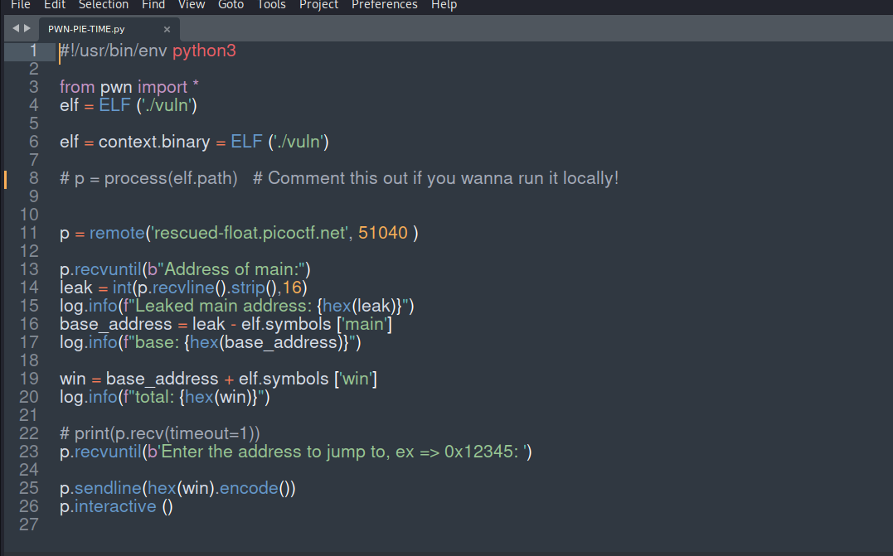

`base_address = leak - elf.symbols['main']` strips out PIE randomization. `win = base_address + elf.symbols['win']` lands exactly on `win`. pwntools reads the symbol offsets straight from the binary so there is no manual math involved.

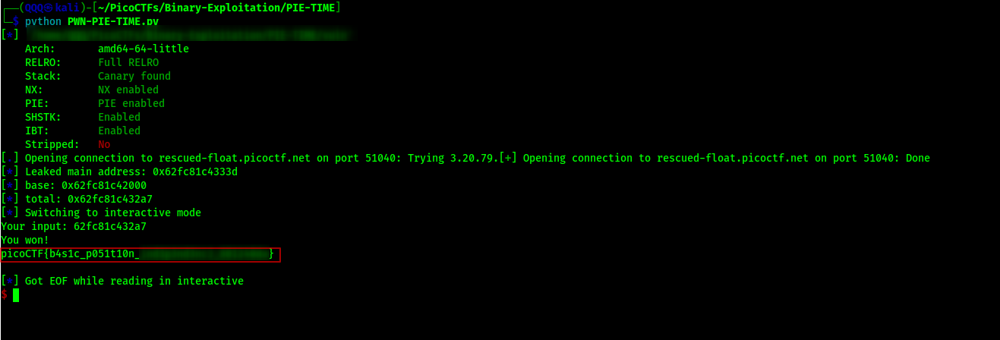

Flag printed automatically.

---

## Step-5: Submitting the Flag

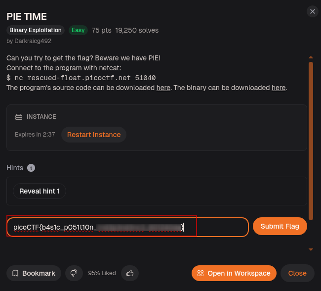

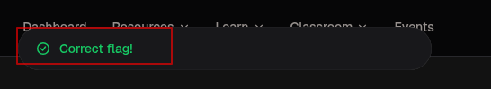
---

## Flag

```
picoCTF{b4s1c_p051t10n_***************?}
```

---

## What This Challenge Teaches

PIE TIME is a direct lesson in what PIE actually does and how to defeat it when the binary cooperates by leaking its own address:

- PIE randomizes the load address every run but function offsets inside the binary never change
- A single leaked address is enough to calculate every other address at runtime
- GDB lets you find offsets before exploitation even when live addresses change
- pwntools automates the entire leak and calculate flow cleanly with `elf.symbols`

The binary handed us `main`s address. We did the math. That was the whole challenge.
