---

## Challenge Overview

> Solve the quiz. Download the source code and binary to answer questions.

Not your typical **"smash the stack and get a shell"** challenge. Quizploit is a quiz about binary analysis **13** questions (0xD) that walk you through understanding an ELF binary from the ground up. No exploitation needed, just reading, thinking, and knowing where to look.


---

## Setup

After downloading, the folder had two things that matter `vuln` (the binary) and `vuln.c` (the source).

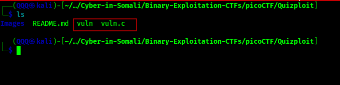

Reading the source first is always the right move before touching the binary, understand what it's supposed to do.

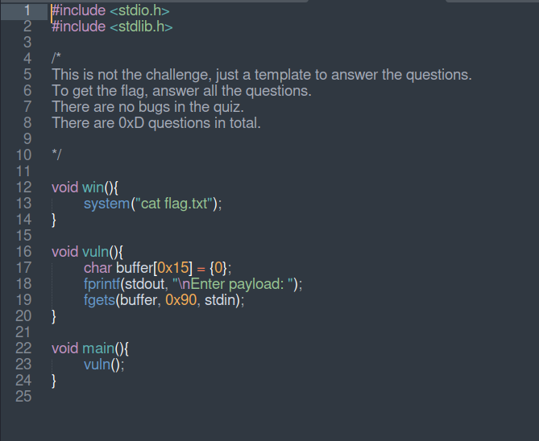

The code is simple: a `win()` function that prints the flag, a `vuln()` function with a small buffer and a generous `fgets`, and a `main()` that only calls `vuln()`. Classic setup. `win()` is never called that's intentional, and it becomes relevant later.

Then we connected to the instance and launched the quiz.

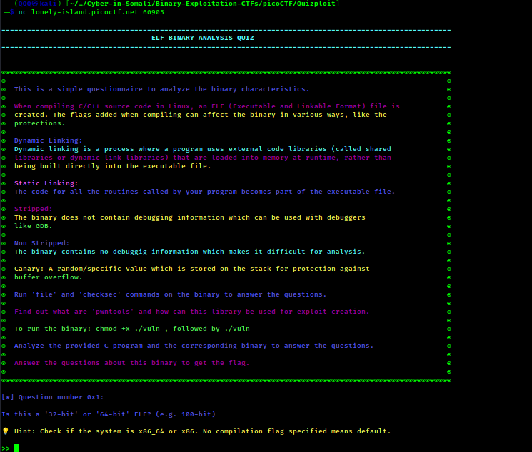

---

## The Questions

### Q1: Is this a 32-bit or 64-bit ELF?

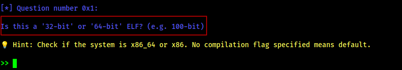

We ran `file` on the binary. This is the first thing you do with any unknown binary it tells you the architecture, linking type, and more in one shot.

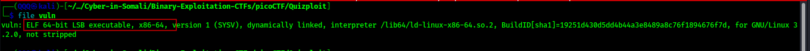

The output said `ELF 64-bit` : so the answer was straightforward.

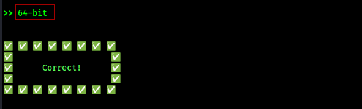

**Answer: `64-bit`**
64-bit means the binary is compiled for a 64-bit architecture (x86-64), so registers are 64-bit wide, memory addresses are 8 bytes, and the calling convention is different from 32-bit. This matters in exploitation because things like padding size and address format change depending on the architecture.

---

### Q2: What's the linking of the binary?

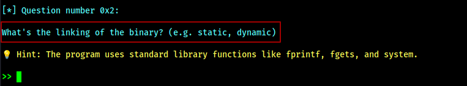

Same `file` output from before it also told us the binary is `dynamically linked`. Dynamic linking means the binary doesn't bundle standard library functions like `printf` or `system` into itself. Instead, it pulls them from shared libraries (like `libc`) at runtime. Why does that matter for exploitation? Because when you know a binary is dynamically linked, you know those library functions exist somewhere in memory during execution and techniques like ret2libc rely on exactly that.

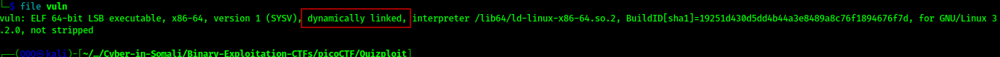

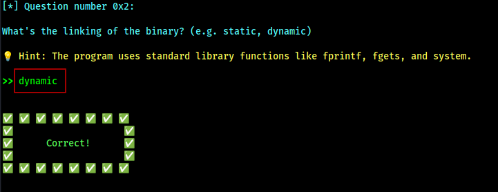

**Answer: `dynamic`**
A dynamically linked binary depends on external libraries loaded at runtime. That means functions like `system()` aren't baked into the binary itself, they live in `libc`. For an attacker, that's useful, because if you can figure out where `libc` is in memory, you can redirect execution to any function inside it.

---

### Q3: Is the binary stripped or not stripped?

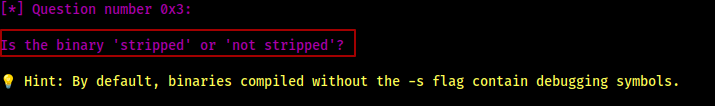

Still the same `file` output at the very end it said `not stripped`. A stripped binary has its debug symbols removed, making reverse engineering harder. Since this one isn't stripped, tools like GDB can still resolve function names which makes Q13 a lot easier.

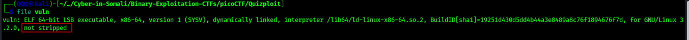

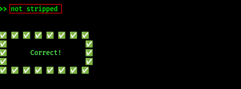

**Answer: `not stripped`**
Symbols like function names and variable names are still present in the binary. That means when you load it in GDB or run `nm`, you can see `win`, `vuln`, `main` by name instead of just raw addresses. Makes analysis significantly faster.

---

### Q4: What is the size of the buffer in bytes?

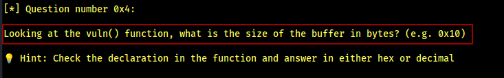

Back to the source code. In `vuln()`, the buffer is declared as `char buffer[0x15]`. That's the allocation size : 0x15 bytes (21 in decimal).

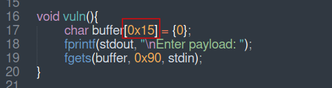

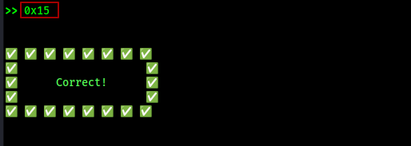

**Answer: `0x15`**
The stack allocates exactly 21 bytes for this buffer. Anything written beyond that starts overwriting adjacent memory on the stack, which includes saved registers and eventually the return address.

---

### Q5: How many bytes are read into the buffer?

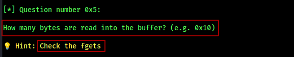

The hint said "check fgets" and sure enough, `fgets(buffer, 0x90, stdin)` reads up to `0x90` bytes. The buffer is only `0x15` bytes, but `fgets` is reading `0x90`. That mismatch is the vulnerability.

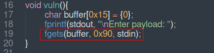

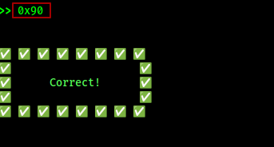

**Answer: `0x90`**
`fgets` is told it can read up to 0x90 (144) bytes, but the buffer it's writing into is only 21 bytes. The programmer passed the wrong size, and that gap is exactly what makes this exploitable.

---

### Q6: Is there a buffer overflow vulnerability?

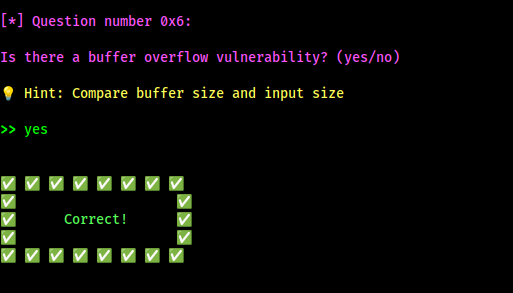

Buffer is `0x15` bytes. Input is `0x90` bytes. You're writing way more than the buffer can hold that's a buffer overflow by definition.

**Answer: `yes`**
When input size exceeds buffer size with no bounds check in place, you have a buffer overflow. The excess bytes don't disappear, they keep writing into whatever comes next on the stack.

---

### Q7: Name a standard C function that could cause a buffer overflow in the provided C code.

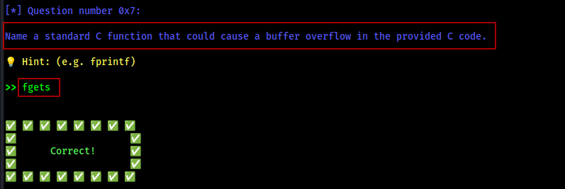

`fgets` is the culprit here. It reads user input without checking whether it fits the buffer it's writing into at least not relative to the buffer's actual size, only relative to what you tell it.

**Answer: `fgets`**
`fgets` is safer than `gets` since it takes a size argument, but it's only as safe as the size you give it. Here the programmer passed `0x90` instead of `sizeof(buffer)`, which turned a safe function into a vulnerability.

---

### Q8: What is the name of the function which is not called anywhere in the program?

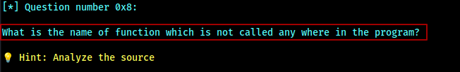

Going back to the source : `win()` calls `system("cat flag.txt")` and is never invoked by `main()` or anywhere else. It's a classic "hidden" function planted there as the target for a ret2win exploit.

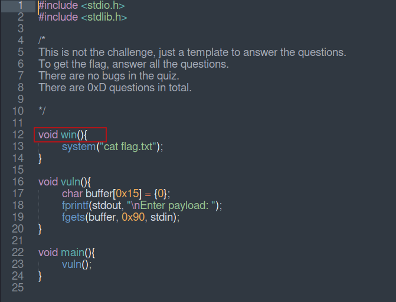

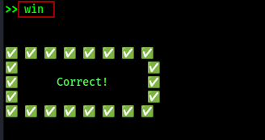

**Answer: `win`**
`win()` exists in the binary but is never called legitimately. The goal of a ret2win attack is to overflow the buffer, overwrite the return address with the address of `win()`, and make the program jump there when `vuln()` returns.

---

### Q9: What type of attack could exploit this vulnerability?

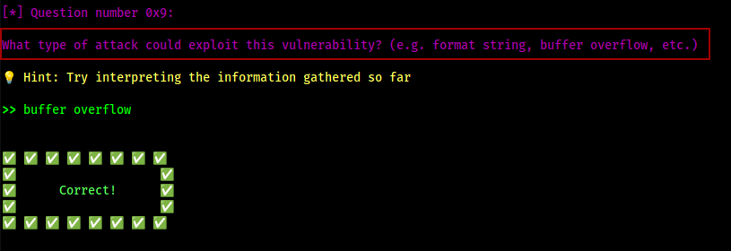

Putting it all together. The buffer holds `0x15` bytes, `fgets` reads `0x90`, and there's no canary protecting the stack. When you write past the buffer, you don't just corrupt random memory you keep going until you hit the saved return address on the stack. That's the address the CPU jumps to when the function finishes. Overwrite it with something you control, and you control where execution goes next. That's a buffer overflow attack.

**Answer: `buffer overflow`**
The stack frame for `vuln()` looks roughly like: `[buffer][saved rbp][return address]`. Once you overflow past the buffer and the saved base pointer, the next thing you're writing into is the return address. Point that at `win()` and the flag is yours.

---

### Q10: How many bytes of overflow are possible?

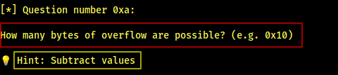

The hint said "subtract values" meaning `fgets size - buffer size`. We wrote a quick Python script to do the hex subtraction cleanly: `0x90 - 0x15 = 0x7b`.


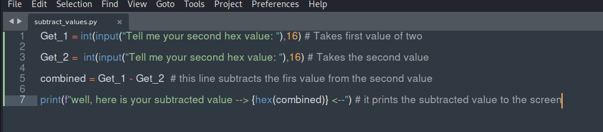

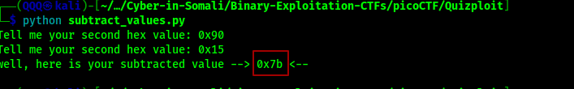

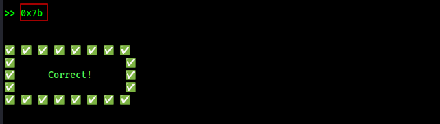

**Answer: `0x7b`**
0x7b is 123 bytes of overflow room. That's more than enough to reach the return address and redirect execution wherever you want.

---

### Q11: What protection is enabled in this binary?

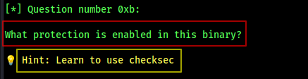

We ran `checksec` against the binary. This tool checks which security mitigations are compiled in stack canaries, PIE, NX, RELRO, and more. The output showed `NX enabled`. NX stands for No-eXecute it's a hardware-level protection that marks certain memory regions, like the stack, as non-executable. In plain terms: you can write your shellcode there all you want, but the CPU will refuse to run it. That closes off the simplest exploitation path of just injecting code and jumping to it.

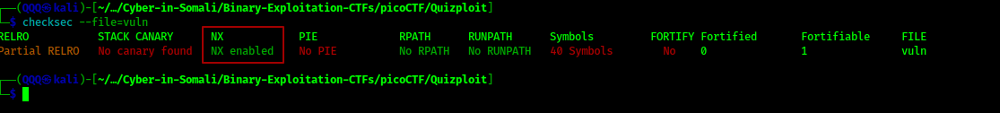

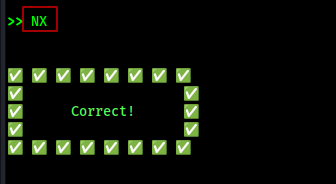

**Answer: `NX`**
NX is enforced at the hardware level via memory page permissions. The stack is marked as writable but not executable. So even though we can overflow into it, we can't run code from it directly. That's why we need ROP instead of plain shellcode.

---

### Q12: What exploitation technique could bypass NX?

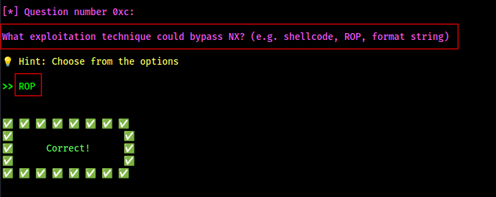

NX stops you from running your own code but it says nothing about the code already sitting in the binary. Return-Oriented Programming (ROP) takes advantage of that. Instead of injecting shellcode, you find small sequences of existing instructions in the binary that end with a `ret` instruction, these are called gadgets. By chaining them together and controlling the stack, you steer execution through these gadgets one by one, making the program do what you want using its own code against it.

**Answer: `ROP`**
Since NX blocks injected code, ROP reuses what's already there. Every `ret` instruction hands control back to whatever address is on top of the stack next, so by carefully crafting the stack layout you can chain gadgets together to call functions, set arguments, and ultimately get execution where you want it.

---

### Q13: What is the address of `win()` in hex?

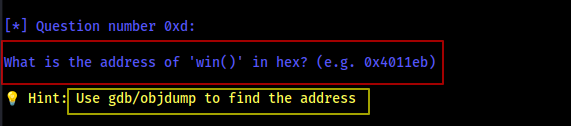

The final question. We needed the exact memory address of `win()` to complete the picture. Two things made this straightforward: the binary is not stripped (so function names are still intact) and PIE is disabled. PIE stands for Position Independent Executable, it's a protection that randomizes where the binary loads in memory each run. Without it, addresses are fixed at compile time and never change. That means `win()` will always be at the same address, every single time. We had three ways to confirm it GDB, `nm`, and `objdump`. All three agreed: `0x401176`.

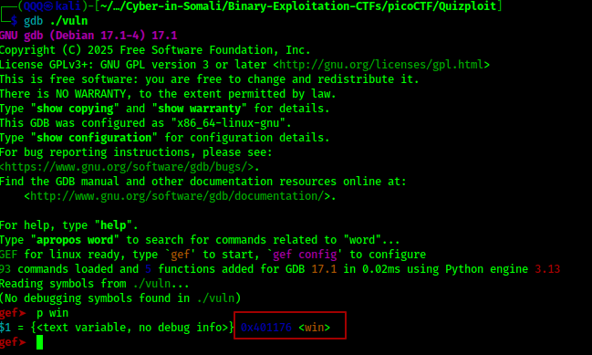

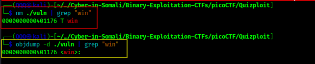

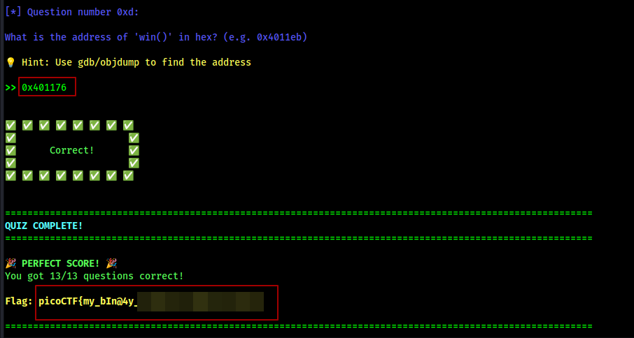

**Answer: `0x401176`**
With PIE disabled, this address is hardcoded. Every time you run the binary, `win()` will be at `0x401176`. That's exactly what you'd put in your payload to overwrite the return address and land in `win()`.

---

## Flag

```
picoCTF{my_bIn@4y_...}
```

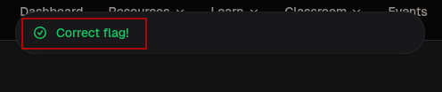

---

## What This Challenge Teaches

Quizploit is less about getting a flag and more about building a mental checklist for binary analysis. By the end of it you've practiced the exact recon steps you'd run against any unknown binary:

- `file` for architecture and metadata
- reading source for logic and vulnerabilities  
- `checksec` for protections
- GDB / `nm` / `objdump` for symbol resolution