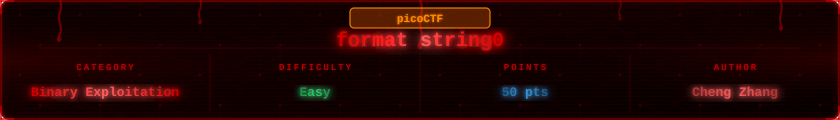


## Challenge Overview

> Can you use your knowledge of format strings to make the customers happy?

The title and the question tell you everything. This one is about format strings, not overflows. The binary wraps its vulnerability inside a burger restaurant story. Our job is to play along, pick the right burgers, and let `printf` do the dirty work for us.

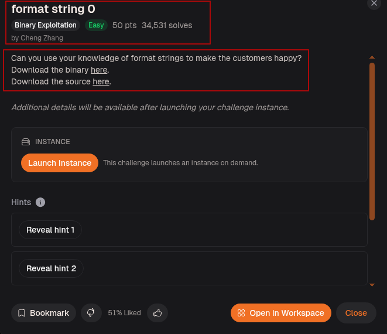

---

## Step-1: Setup

Launched the instance.

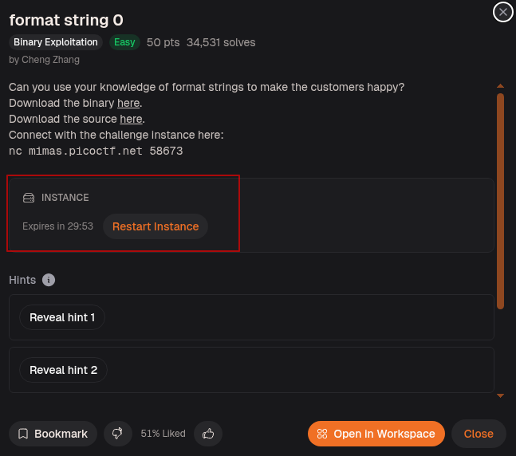

Ran `file` and `checksec` on the binary.

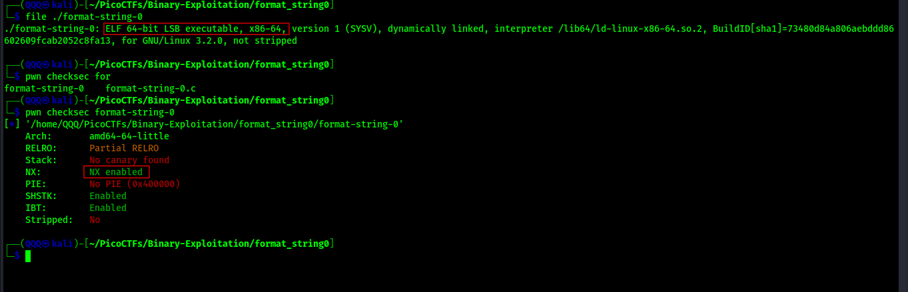

`ELF 64-bit`, No PIE, NX enabled, no canary found, not stripped. No PIE means addresses are fixed which makes it easier to reason about memory. No stack canary means nothing is protecting the stack from being corrupted.

---

## Step-2: Running It for the First Time

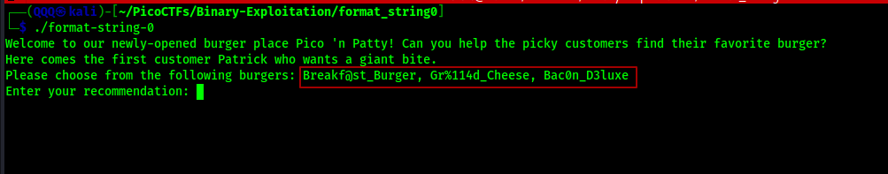

The binary drops us into a burger restaurant story. Patrick is the first customer and he wants a burger from this menu:

* `Breakf@st_Burger`
* `Gr%114d_Cheese`
* `Bac0n_D3luxe`

One of those options has a `%114d` in it. That is not a typo. That is a format specifier sitting inside a menu option, and that is the whole challenge.

---

## Step-3: Reading the Source

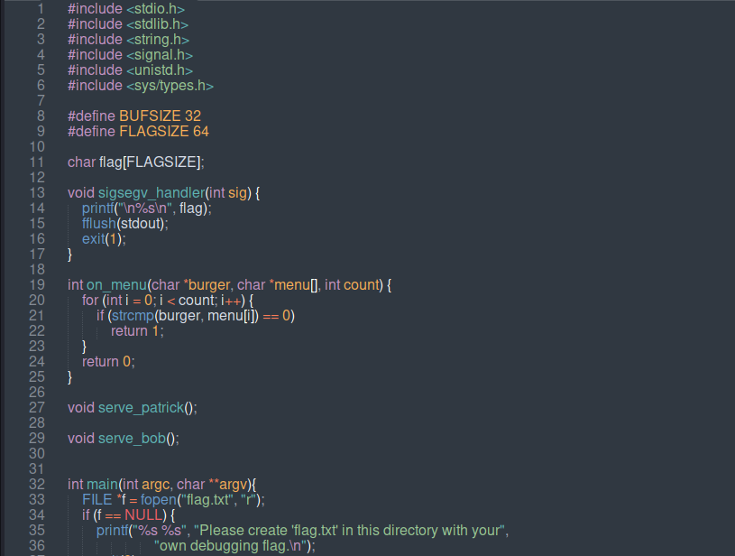

`flag` is a global char array. The `sigsegv_handler()` function prints it when the program receives a segmentation fault signal. `signal(SIGSEGV, sigsegv_handler)` registers it in `main()`. So the goal is clear: crash the program with a segfault and the flag prints itself.

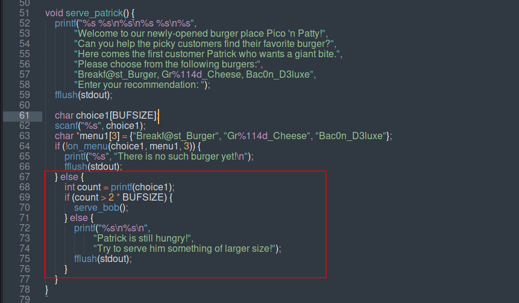

`serve_patrick()` is where the first trap is. The user input goes into `choice1[BUFSIZE]` via `scanf("%s", choice1)`. Then on line 68 there is `int count = printf(choice1)`. This is the vulnerability. `printf` is being called with user input directly as the format string, not as `printf("%s", choice1)`. That means any format specifiers inside the input get interpreted and executed by `printf`.

The condition on line 69 checks `if (count > 2 * BUFSIZE)`. `BUFSIZE` is 32 so the threshold is 64 characters printed. Only then does the program advance to `serve_bob()`.

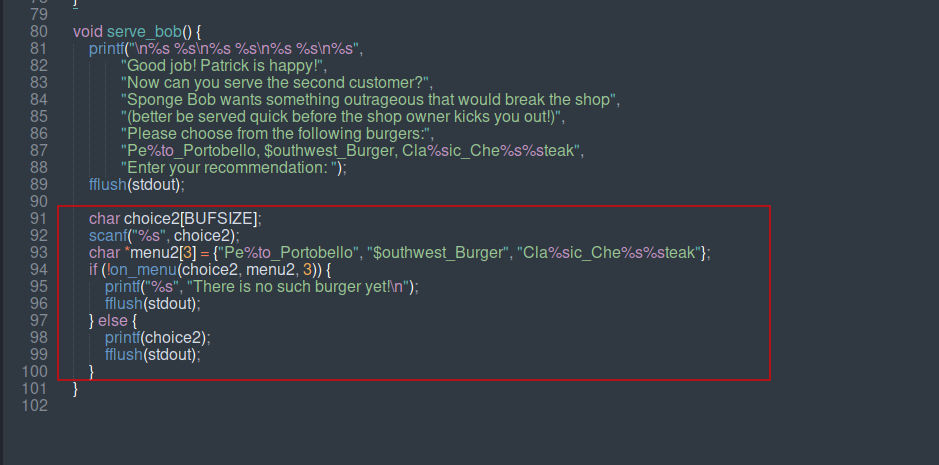

`serve_bob()` has the same pattern. Input goes into `choice2[BUFSIZE]` and then `printf(choice2)` is called bare on line 98 with no format string guard. The menu this time is:

* `Pe%to_Portobello`
* `$outhwest_Burger`
* `Cla%sic_Che%s%steak`

`Cla%sic_Che%s%steak` has three `%s` format specifiers inside it. When `printf` processes `%s` it tries to read a pointer from the stack and print whatever string is at that address. With no arguments passed, it reads garbage stack values as pointers and tries to dereference them. That causes a segmentation fault. The signal handler catches it and prints the flag.

---

## Step-4: Understanding Why These Two Burgers

For Patrick the only burger that works is `Gr%114d_Cheese`. Here is why:

`%114d` tells `printf` to print an integer padded to 114 characters wide. Even though no integer argument was passed, `printf` still grabs a value off the stack and prints it padded to 114 characters. The total output becomes much larger than 64 characters which satisfies `count > 2 * BUFSIZE` and unlocks `serve_bob()`. The other two burgers, `Breakf@st_Burger` and `Bac0n_D3luxe`, have no format specifiers so their output length never exceeds 64.

For Bob the only burger that works is `Cla%sic_Che%s%steak`. It contains three `%s` specifiers. Each one makes `printf` read a stack value as a string pointer and try to print from that address. Those addresses point to invalid memory which causes a segfault. The handler fires and the flag is printed.

---

## Step-5: Confirming Locally

Created a local fake flag and ran the binary with the two correct burger choices.

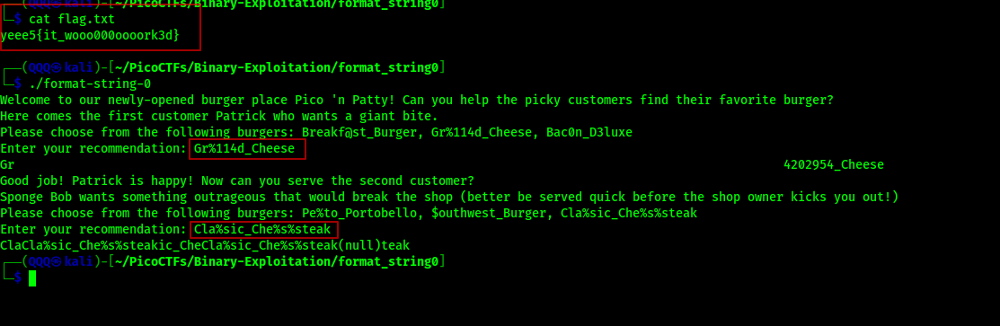

Entered `Gr%114d_Cheese` for Patrick. The output showed the padded integer printed wide, confirming the format specifier fired and the character count exceeded 64. The program moved to Bob. Entered `Cla%sic_Che%s%steak` for Bob. The `printf` tried to dereference stack pointers as strings, hit invalid memory, and the fake flag printed from the segfault handler. Exploit confirmed locally.

---

## Method 1: Manual via netcat

Connected to the remote instance and entered the two burgers manually.

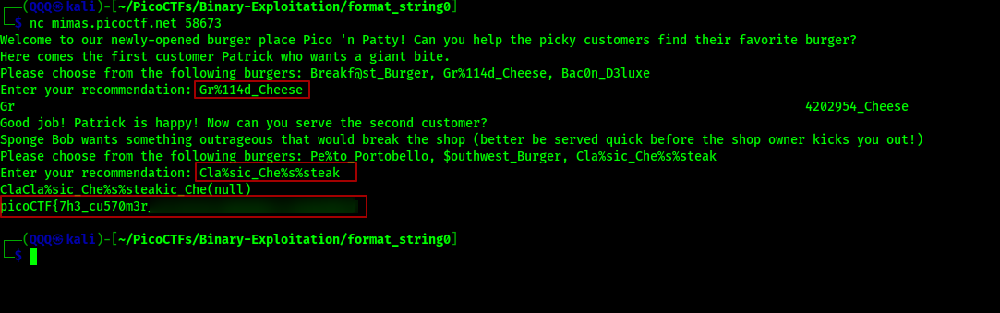

`Gr%114d_Cheese` for Patrick unlocked Bob's stage. `Cla%sic_Che%s%steak` for Bob triggered the segfault. The real flag printed.

---

## Method 2: One-liner via echo pipe

Piped 50 A's directly into the binary over netcat. `choice1` can only hold 32 bytes but scanf(`"%s"`, `choice1`) keeps writing regardless of size. The 50 `A's` blow straight past the buffer, overwrite the return address and other critical stack values, and the program crashes with a segfault which fires the handler and prints the flag.

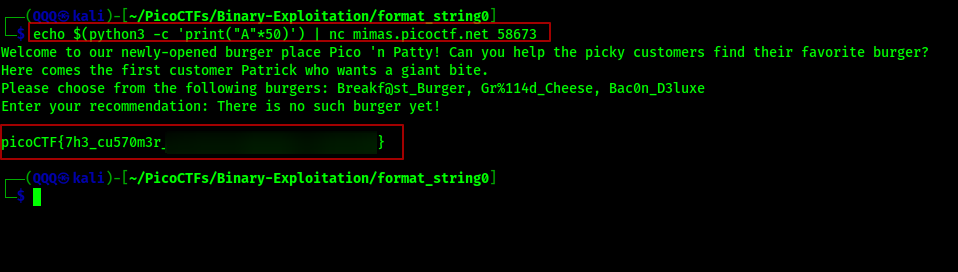

Flag printed automatically without even needing to pick a valid burger.

---

## Flag

```
picoCTF{7h3_cu570m3r_*************}
```
> Nah we are not spoiling the whole thing! You have the binary and the offset, go finish it!
---

## What This Challenge Teaches

format string 0 is a direct demonstration of why `printf(user_input)` is never safe:

* Passing user input directly as the format string to `printf` lets the attacker inject format specifiers
* `%114d` inflates the output character count without any extra input, which can be used to satisfy length conditions
* `%s` with no arguments reads arbitrary stack values as string pointers and causes segfaults
* A segfault signal handler that prints the flag is a common CTF pattern that rewards controlled crashes
* The same class of vulnerability exists whether the input is on the stack or the heap