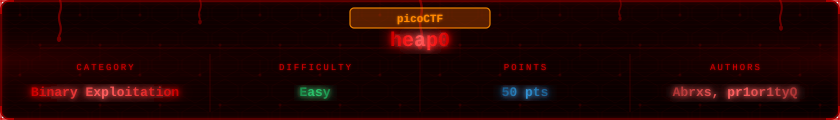


## Challenge Overview

> Are overflows just a stack concern?

The title and the question tell you everything. This one is about the heap, not the stack. The binary brags that its data is safe because it lives on the heap. Our job is to prove it wrong.

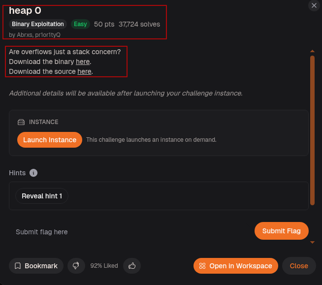

---

## Step-1: Setup

Launched the instance.

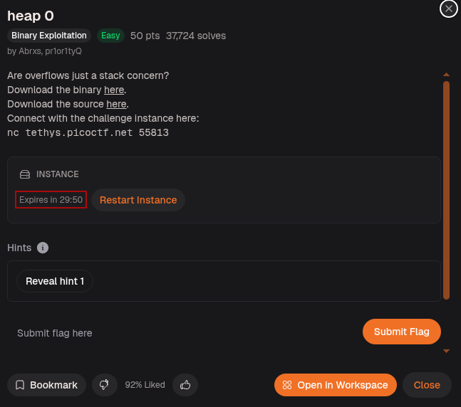

Ran `file` and `checksec` on the binary.

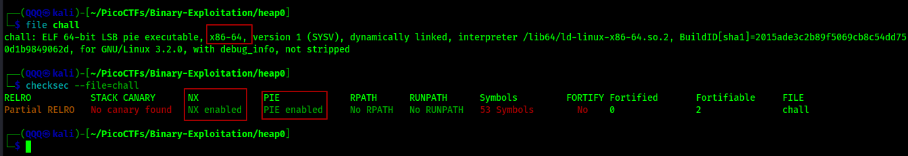

`ELF 64-bit`, PIE enabled, NX enabled, no canary found, not stripped. No stack canary means heap corruption is the path forward, and no canary also means the buffer on the heap has no protection at all.

---

## Step-2: Running It for the First Time

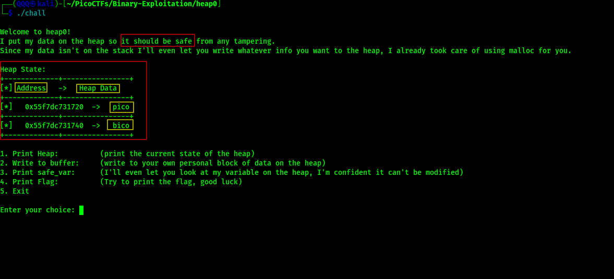

The binary shows a heap state table with two allocations:
* `input_data` at the first address holding `pico`
* `safe_var` at the second address holding `bico`

Then it gives us a menu with 5 options. The key one is option 4 which tries to print the flag but only does so if `safe_var` no longer equals `bico`.

---

## Step-3: Exploring the Menu

Selected option 1 to print the heap state.

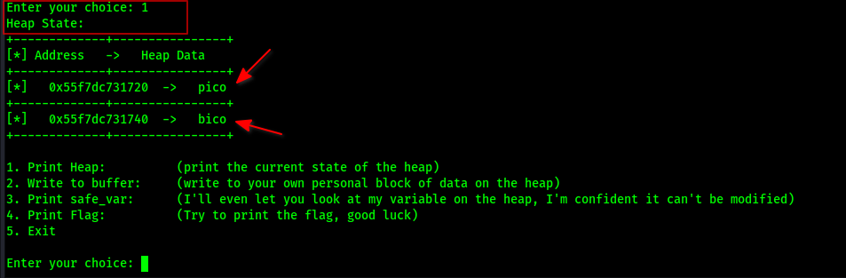

Two heap chunks sitting next to each other in memory. `input_data` holds `pico`, `safe_var` holds `bico`. They are adjacent which is the whole point.

Selected option 3 to see `safe_var`.

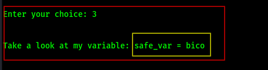

`safe_var = bico` confirmed. That is what stands between us and the flag.

Selected option 4 to try printing the flag.

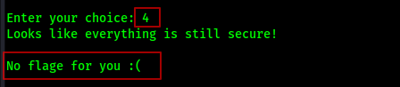

`No flage for you :(` exactly as expected since `safe_var` is still `bico`.

---

## Step-4: Reading the Source

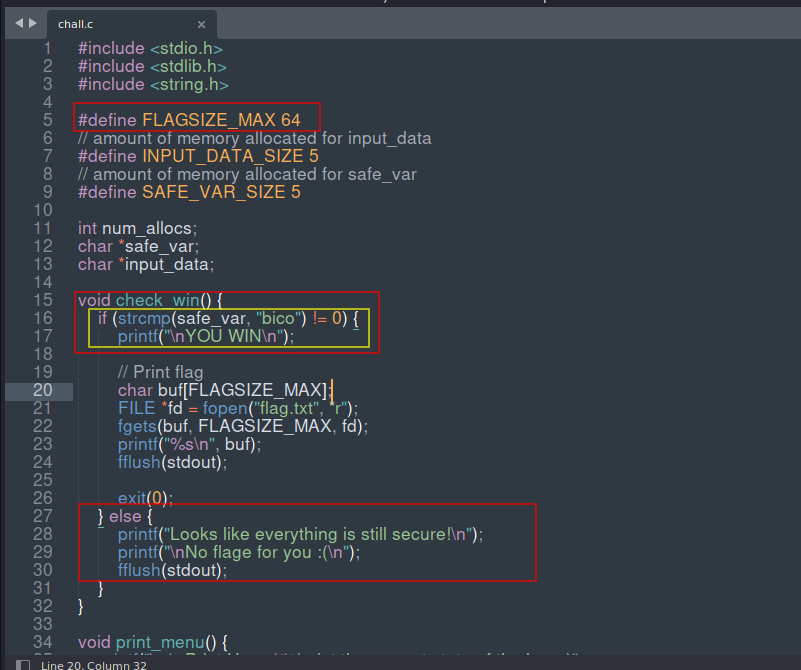

`check_win()` does a `strcmp(safe_var, "bico")`. If it does NOT equal `bico`, we win. That is the condition we need to break.

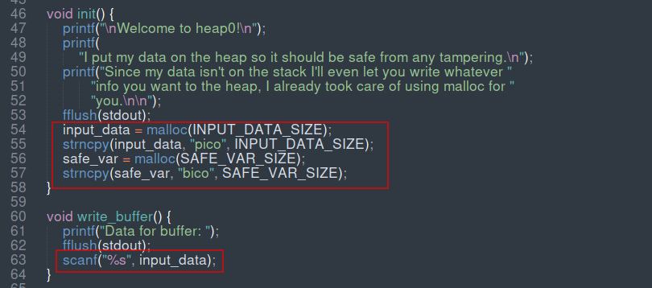

`init()` allocates `input_data` first then `safe_var` right after it on the heap. The main loop uses a switch to handle each menu choice. Case 2 calls `write_buffer()` which is where the overflow happens, and case 4 calls `check_win()`.

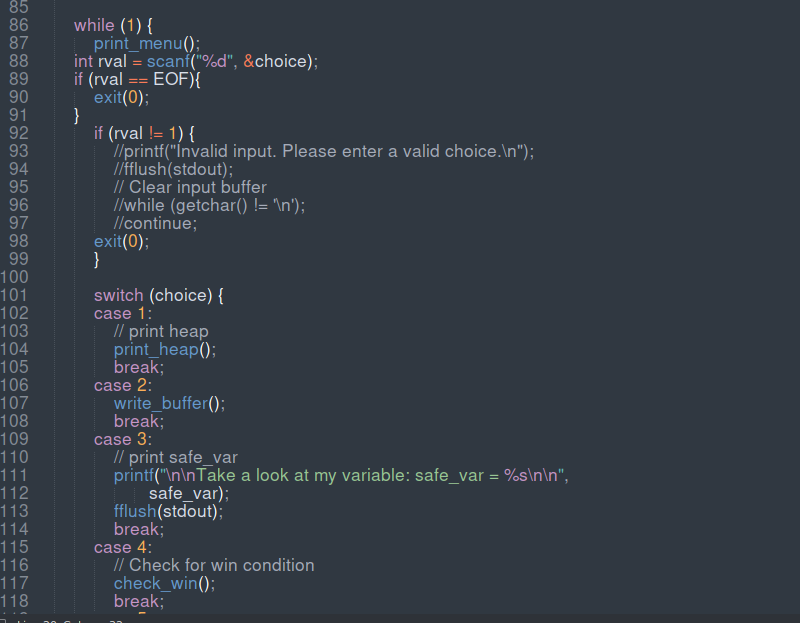

`init()` allocates `input_data` first then `safe_var` right after it on the heap. `write_buffer()` uses `scanf("%s", input_data)` with no size limit. That is the vulnerability. Write enough bytes into `input_data` and it overflows straight into `safe_var`.

---

## Step-5: First Attempt

Tried writing a bunch of Q's into the buffer then selecting option 4.

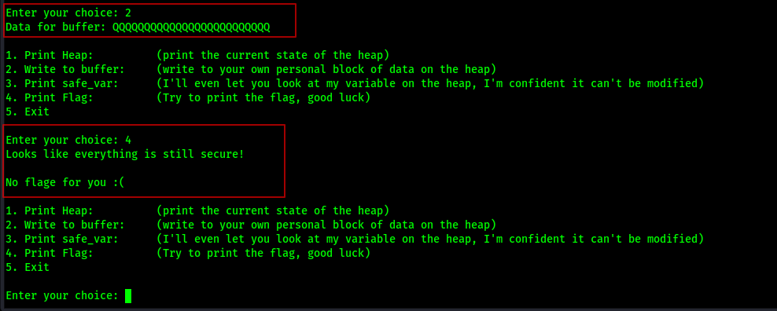

Still `No flage for you :(`. Not enough bytes to reach `safe_var` yet.

---

## Step-6: Finding the Offset

Created a local fake flag to test with.

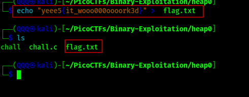

Loaded the binary in GDB and used `msf-pattern_create` to generate a 300-byte cyclic pattern, then fed it into the buffer.


After the overflow, the heap state showed the pattern had spilled into `safe_var`. Selected option 4 and got the fake flag. Then ran `msf-pattern_offset` on the value found in `safe_var`.

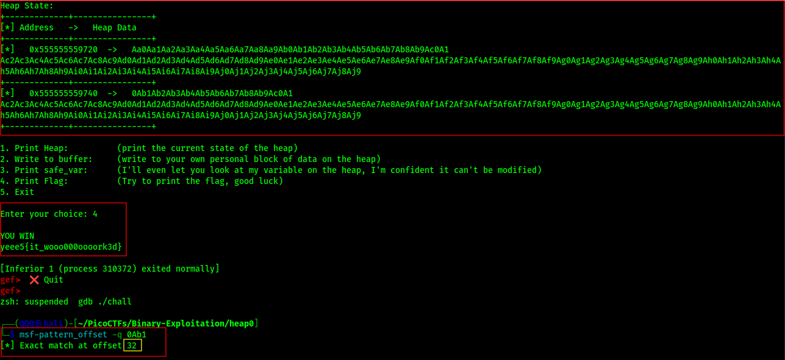

`Exact match at offset 32`. So we need exactly 32 bytes to reach `safe_var`, and whatever comes after byte 32 overwrites it.

---

## Step-7: Confirming with A's

Verified the offset with 33 A's 32 to fill `input_data` and 1 to land in `safe_var`.

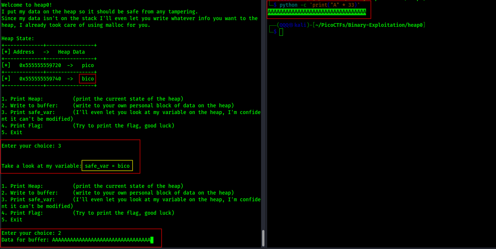

Selected option 3 to check `safe_var`.

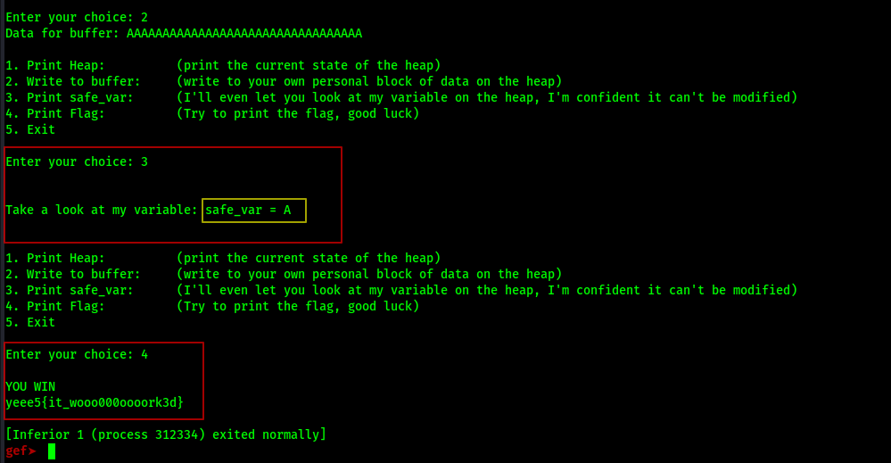

`safe_var = A` overwrite confirmed. Option 4 printed the fake flag.

---

## Method 1: Manual via netcat

Connected to the remote, selected option 2, sent 33 A's, selected option 4.

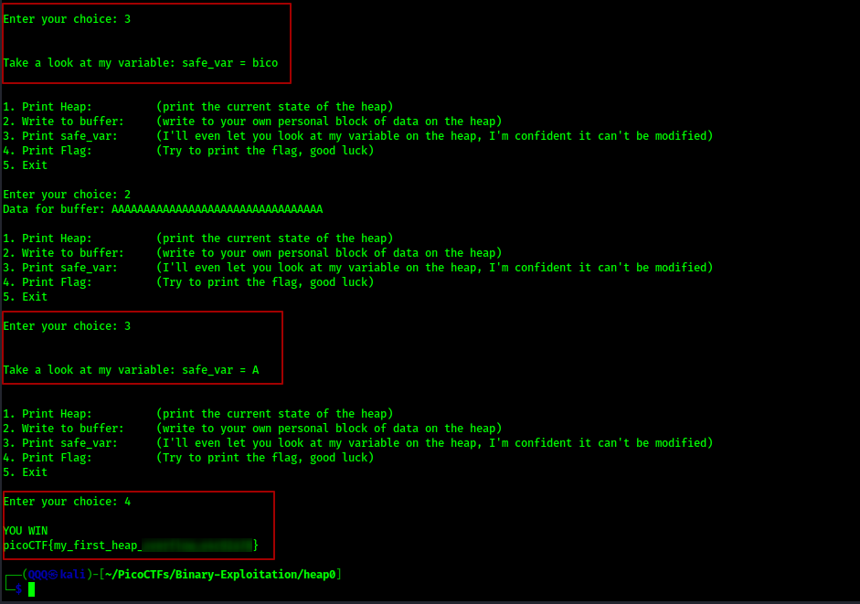

`YOU WIN` and the real flag printed.

---

## Method 2: Automated with pwntools

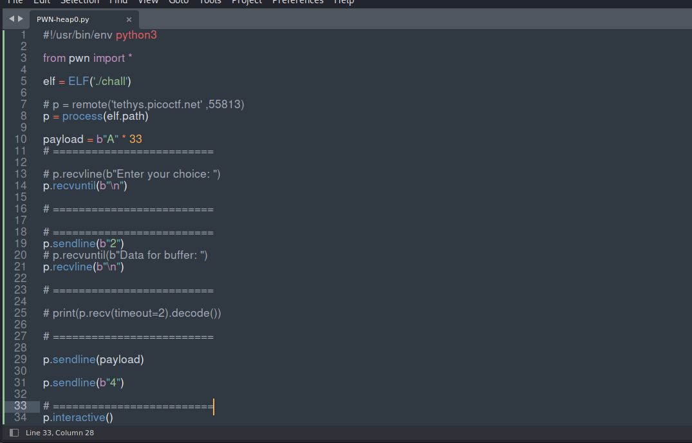

The script connects remotely, waits for the menu, sends choice `2`, sends the payload of 33 A's, then sends choice `4` to trigger `check_win()`.

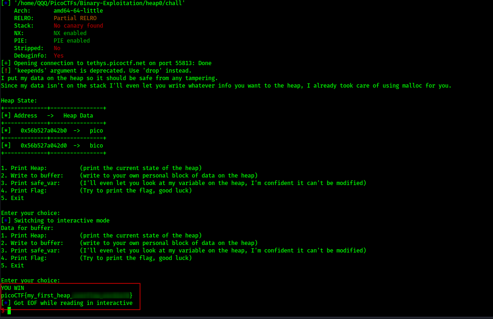

Flag printed automatically.

---

## Step-8: Submitting the Flag

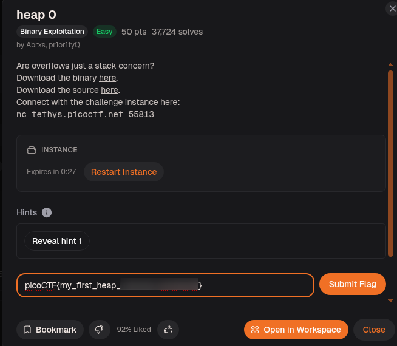

> Nah we are not spoiling the whole thing! You have the binary and the offset, go finish it!


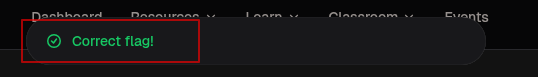

---

## Flag

```
picoCTF{my_first_heap_***************}
```

---

## What This Challenge Teaches

heap 0 is a direct answer to its own question overflows are not just a stack concern:

* Heap allocations that sit adjacent in memory can overflow into each other
* `scanf("%s")` with no size limit is dangerous anywhere, stack or heap
* The offset between two heap chunks can be found the same way as stack offsets using cyclic patterns
* Corrupting a single variable on the heap is enough to change program behavior completely