## Challenge Overview

> The "secure" echo service welcomes you politely... but what if you don't stay polite? Can you make it reveal the hidden flag?

The name says secure. The binary says secure. The source code tells a different story. There is a `win()` function sitting in the binary that reads and prints the flag, and the program never calls it. Our job is to hijack execution and call it ourselves.

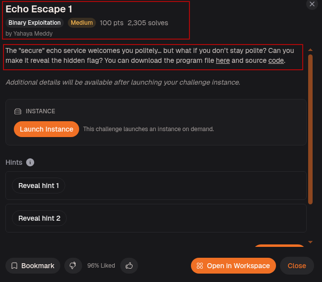

---

## Step-1: Setup

Ran `file` on the binary.

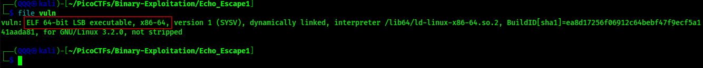

`ELF 64-bit`, dynamically linked, not stripped.

Ran `checksec` on the binary.

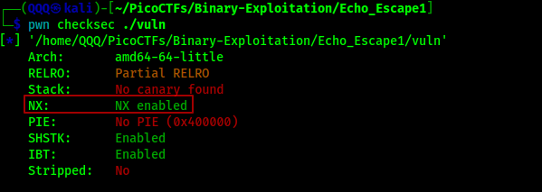

* Stack canaries are absent, so overwriting the saved return pointer won’t be detected. 
* NX is active, meaning injected shellcode on the stack can’t execute. 
* The important part is that PIE is disabled, which keeps the program mapped at the same address every run. Because of that, functions like `win()` always have a predictable address.

---

## Step-2: Reading the Source

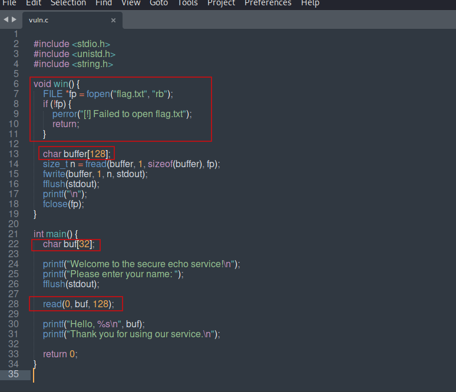

Two things stand out immediately.

First, `win()` opens `flag.txt`, reads it into a 128-byte buffer, and writes it to stdout. The program never calls `win()` from `main()`. It is just sitting there waiting to be called.

Second, `main()` declares `buf[32]` but then calls `read(0, buf, 128)`. It allocates 32 bytes on the stack but reads up to 128 bytes into it. That is 96 bytes of overflow available. Anything past byte 32 starts overwriting adjacent stack data including the saved base pointer and the return address. When `main()` hits its `ret` instruction, it jumps to whatever address we placed there.

---

## Step-3: Running It for the First Time

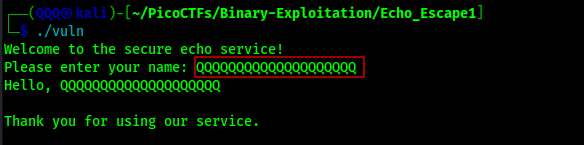

The program starts by greeting us, asking for a name, printing our input back to us, and then exiting normally. At first glance, everything behaves exactly as expected and regular input doesn’t appear to cause any issues.

However, since the program copies our input into a fixed-size stack buffer, the next step is to test what happens when we provide increasingly larger inputs. Instead of assuming where the crash occurs or how much data is needed, we’ll use a cyclic pattern to precisely determine the offset at which our input begins overwriting important stack data like the saved return address.

---

## Step-4: Finding the Offset

Loaded the binary in GDB with GEF and generated a 130-byte cyclic pattern.

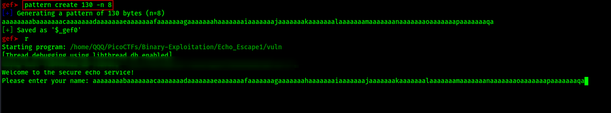

Fed the pattern into the binary as input. The program ran, echoed the pattern back, and crashed.

Checked the registers after the crash.

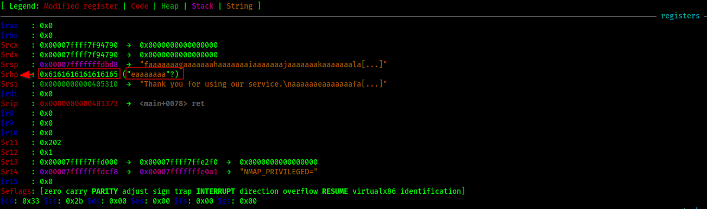

`$rbp` is filled with `0x6161616161616165` which is part of our cyclic pattern. The pattern has landed exactly where the saved base pointer lives on the stack.

Checked the crash reason.

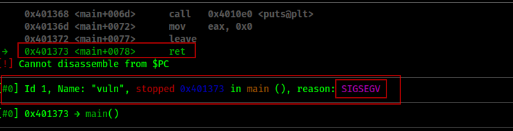

`SIGSEGV` confirmed. The `ret` instruction tried to jump to a garbage address from our pattern and the program crashed. This is exactly what we need, we just have to put the right address there instead of garbage.

Ran `pattern offset` on the value in `$rbp`.

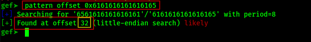

The `32-byte` offset can be confusing at first because it does **not** mean we already control the return address. It only means our input has reached the saved `rbp` value on the stack.

The stack layout looks like this:

```text id="7tksmr"
[ 32-byte buffer ][ saved rbp (8 bytes) ][ return address ]
```

So after filling the 32-byte buffer, the overflow still has to pass over the saved `rbp`, which takes another 8 bytes on a 64-bit system. Only after those extra 8 bytes do we finally reach the return address.

```text id="x9ivlu"
32 bytes (buffer)
+ 8 bytes (saved rbp)
= 40 bytes total
```

That is why the final padding needed to control execution is `40` bytes, not just `32`.

---

## Step-5: Finding the Address of win()

Used `nm` and `objdump` to locate `win()` in the binary.

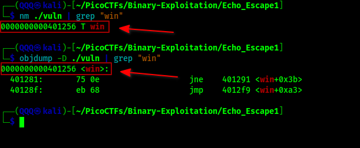

Both confirm that `win()` is located at:

```text
0x0000000000401256
```

Since PIE is disabled, this address stays fixed every time the program runs.

When we actually use this address in an exploit, we usually write it without the extra leading zeros:

```text
0x401256
```

We do this because the leading `0`s don’t change the value they’re just padding for formatting in a full 64-bit address. In memory, the CPU only cares about the actual meaningful hex value, so trimming them makes the address easier to read and use while still being identical in behavior.


---

## Method 1: Manual via Python one-liner and netcat

Built the payload inline and piped it directly to the remote service. 40 bytes of padding followed by the address of `win()` packed in little-endian format.

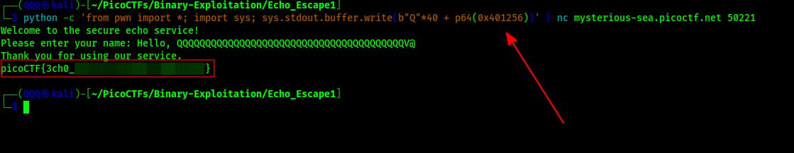

The binary echoed the padding back, hit `ret`, jumped straight into `win()`, and the flag printed.

---

## Method 2: Automated with pwntools

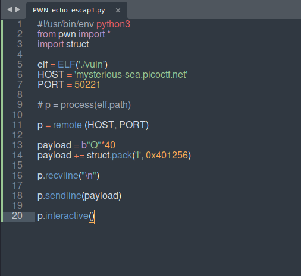

The script loads the binary with `ELF('./vuln')`, connects to the remote host and port, builds the payload as 40 Q's followed by the address of `win()` packed with `struct.pack`, receives the first line, sends the payload, then drops into interactive mode to catch the flag output.

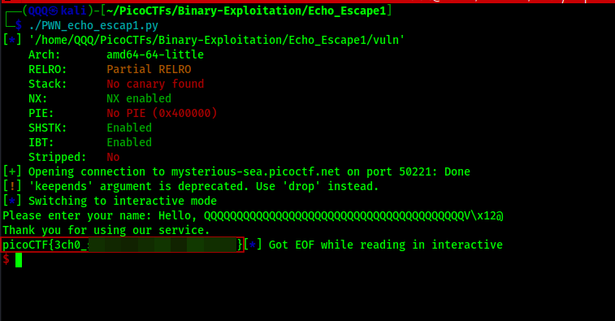

Flag printed automatically.

---

## Step-6: Submitting the Flag

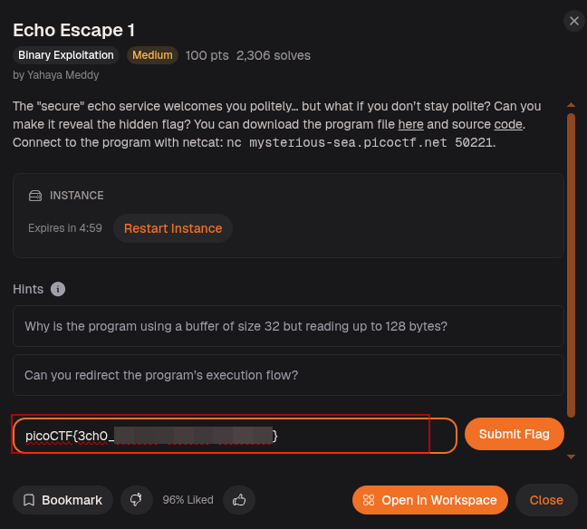

> I could tell you, but where’s the fun in that?  You’ve got the binary and chunk size, now go finish the job like a proper CTF goblin budd!.

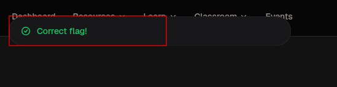

---

## Flag

```
picoCTF{3ch0_*****************}
```

---

## What This Challenge Teaches

Echo Escape 1 is a textbook ret2win:

* A buffer declared as 32 bytes but filled with up to 128 bytes is a classic stack buffer overflow
* No PIE means the binary loads at a fixed address every run, so function addresses never change
* No stack canary means the return address can be overwritten without any protection stopping you
* A cyclic pattern finds the exact offset to the return address without guessing
* ret2win is the simplest form of control flow hijacking: find a useful function already in the binary and redirect execution straight to it