## Challenge Overview

> The developer has learned their lesson from unsafe input functions and tried to secure the program by using fgets(). Unfortunately, they didn't use it correctly. Can you still find a way to read the flag?

The developer thought switching to `fgets()` was the cure. It is not a cure if the dose is wrong. Think of it like a seatbelt that is only buckled halfway, it gives you a false sense of safety while the danger is still there. The buffer holds 32 bytes, `fgets()` accepts 128, and that 96-byte gap is our entire attack surface. There is a `win()` function hiding in the binary that the program never calls. We are going to force it to.

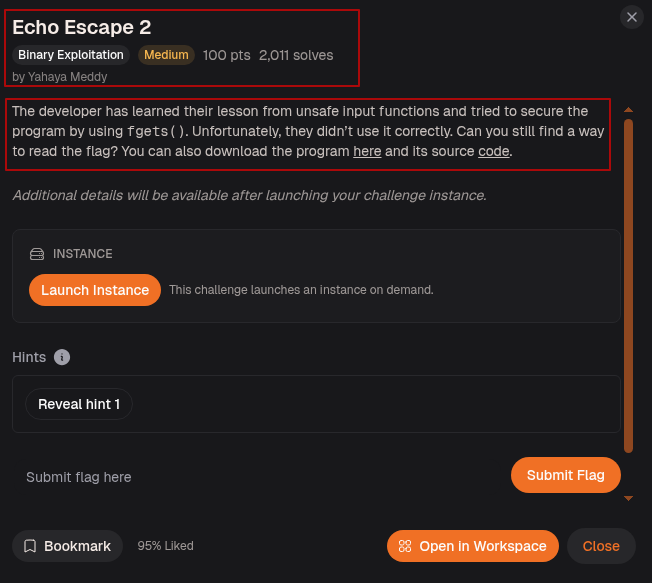

---

## Step-1: Reading the Source

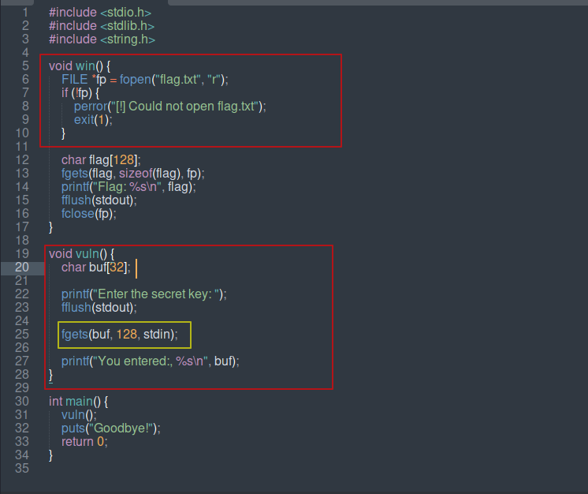

The source lays everything out in the open. `win()` is a gift sitting unwrapped on the table. It opens `flag.txt`, reads it into a local buffer, and prints it straight to stdout. The program never touches it from `main()`.

`vuln()` is where the problem lives. `buf` is declared as 32 bytes. Then `fgets(buf, 128, stdin)` is called. The second argument to `fgets()` is supposed to be the size of the buffer, not how much you feel like reading. Passing 128 here tells `fgets()` it has 128 bytes of room when it only has 32. Anything past byte 32 walks straight over the stack, past the saved base pointer, and into the return address. When `vuln()` returns, we control where execution goes next.

---

## Step-2: Setup

Ran `file` and `checksec` on the binary.

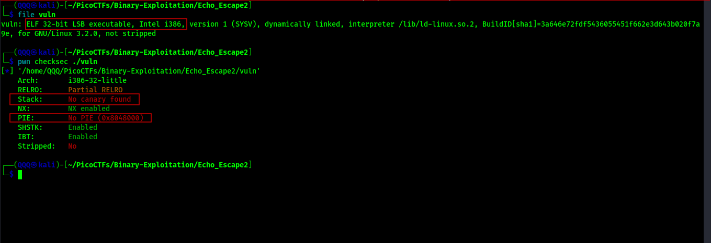

`ELF 32-bit`, No canary found, NX enabled, No PIE. Two things to note here:
* First, this is a 32-bit binary, which means addresses are 4 bytes wide and get packed differently than on 64-bit. 
* Second, no canary and no PIE together are the ideal conditions for a ret2win. No canary means nothing stands between our overflow and the return address. No PIE means `win()` sits at the same address every single run, like a house that never moves.

---

## Step-3: Finding the Offset

Loaded the binary in GDB with GEF and sent a 100-byte cyclic pattern as input.

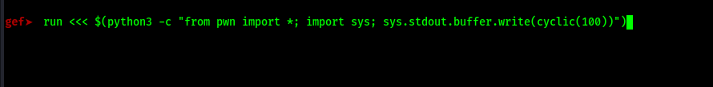

A cyclic pattern is a sequence where every 4-byte chunk is unique. Think of it as a ruler. Wherever the program crashes, the value in the instruction pointer tells us exactly how far into the input we are.

Checked the registers after the crash.

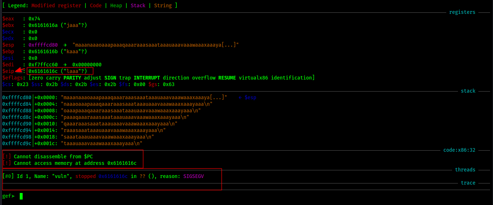

`$eip` landed on `0x6161616c` which decodes to `laaa` from our cyclic pattern. The instruction pointer is completely overwritten. `SIGSEGV` fired because the CPU tried to fetch the next instruction from `0x6161616c` and that address does not exist. Perfect. Now we know our pattern reached `$eip`. We just need to know exactly how far in `laaa` sits.

Ran `pwn cyclic -l laaa` outside GDB to get the exact number.

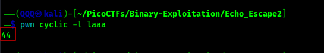

`44`. The first 44 bytes fill `buf` plus the saved base pointer on the stack. Byte 45 is the first byte of the return address. So our payload is 44 bytes of junk followed by the address of `win()`.

---

## Step-4: Finding the Address of win()

Used GDB to print the address of `win()`.

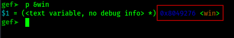

`win` sits at `0x8049276`. No PIE means this never changes. Whether we run it locally or connect to the remote server, `win()` will always be at `0x8049276`. We can hardcode it into our payload with full confidence.

---

## Step-5: Confirming Locally

Tested the full payload against the local binary before touching the remote.

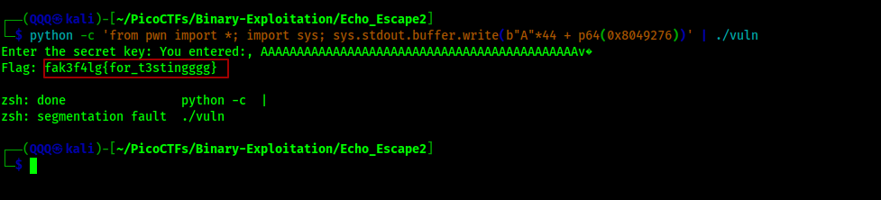

44 A's as padding, then `p64(0x8049276)` appended to land `win()` in the return address slot. The binary printed our padding back, executed `ret`, jumped directly into `win()`, and the fake local flag came out. The exploit works exactly as expected. Time to go remote.

---

## Automated with pwntools

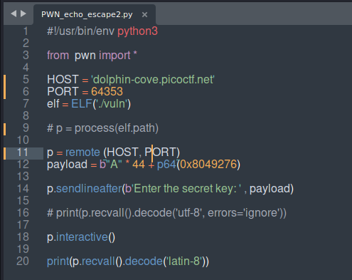

The script is clean and direct. It loads the binary locally with `ELF('./vuln')` so pwntools can read its properties, then connects to the remote instance with `remote(HOST, PORT)`. The payload is assembled as 44 A's plus the address of `win()` packed with `p64()`. The script waits for the prompt, fires the payload with `sendlineafter()`, then hands control to `interactive()` so the flag output comes through live.

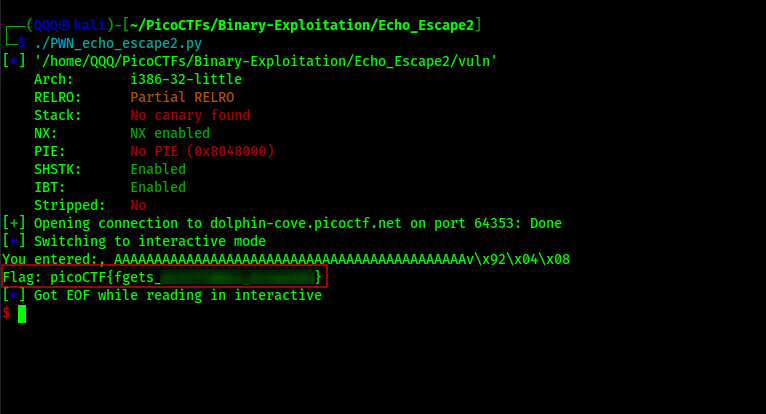

Connection opened, payload sent, flag printed. No manual input needed.

---

## Step-6: Submitting the Flag

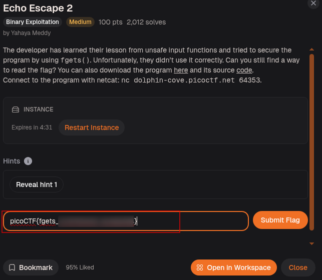

---

## Flag

```
picoCTF{fgets_***************}
```

> *Half the fun is figuring out the last part on your own. You've got the binary and the offset give it a shot!*


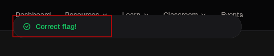

---

## What This Challenge Teaches

Echo Escape 2 proves that the name of a function means nothing if it is used wrong:

* `fgets()` is not inherently safe. It only prevents overflow when the size argument matches the actual buffer size. Passing a larger number is the same mistake as using `read()` with no limit
* Think of the size argument as a promise you make to the buffer. Break that promise and the stack pays the price
* On 32-bit binaries the return address is 4 bytes wide. Pack it with `p32()` in real usage, though `p64()` with a 4-byte address can still work depending on the platform and how pwntools handles it
* The cyclic pattern technique works the same on 32-bit and 64-bit. The only difference is which register to look at: `$eip` on 32-bit, `$rip` on 64-bit
* Always confirm the exploit locally with a fake flag before going remote. It saves time and avoids burning through instance restarts