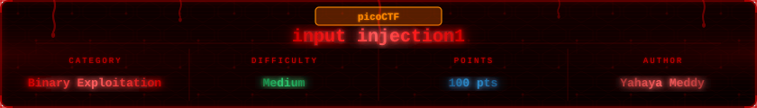
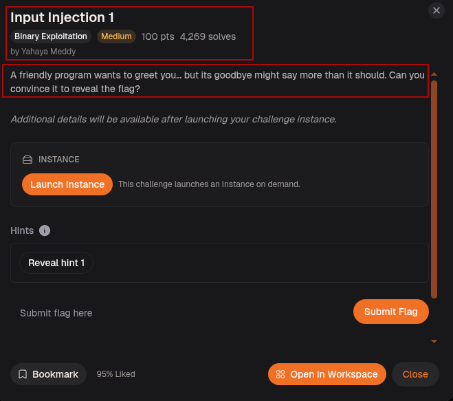
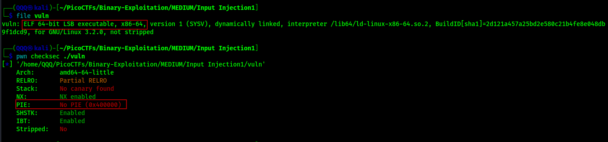
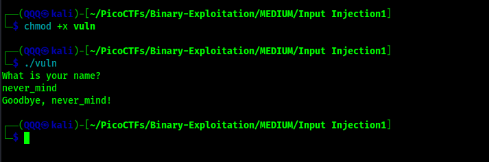
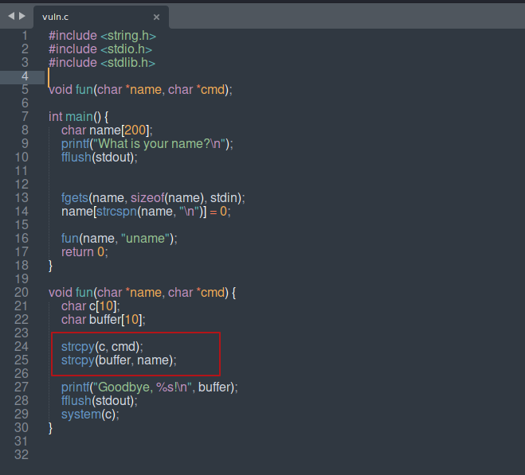
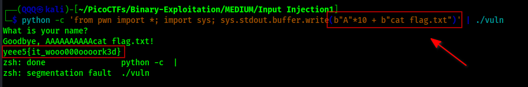
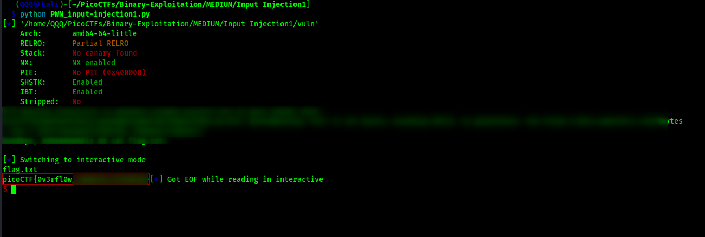
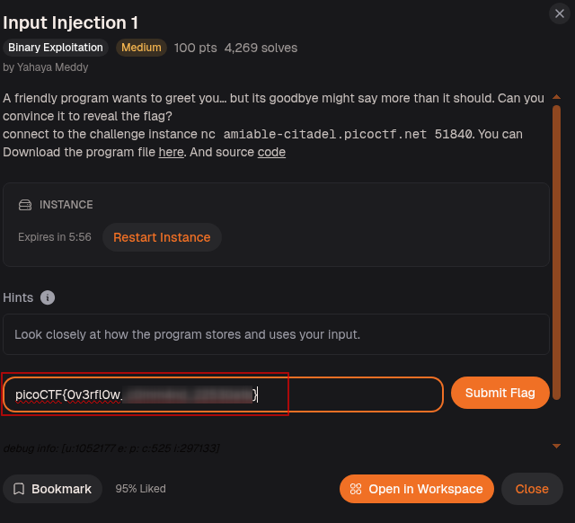
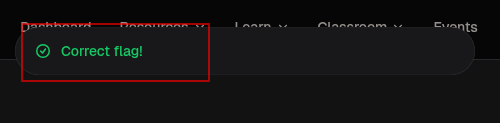

## Challenge Overview

> A friendly program wants to greet you... but its goodbye might say more than it should. Can you convince it to reveal the flag?

The program is polite. It asks for your name, says goodbye, and exits. Nothing suspicious on the surface. But the way it handles your name before saying goodbye is where the story gets interesting. This challenge is not about overflowing a return address or jumping to a `win()` function. It is about feeding the program something it will blindly execute as a system command.



---

## Step-1: Setup

Ran `file` and `checksec` on the binary.



`ELF 64-bit`, No canary found, NX enabled, No PIE. The protections here are mostly irrelevant to the actual vulnerability. There is no return address to hijack, no offset to find, no cyclic pattern needed at all. The bug lives entirely in how the program copies and uses your input, not in where the stack ends up after a function returns.

---

## Step-2: Running It for the First Time



Made the binary executable and ran it. The program asks `What is your name?`, we typed `never_mind`, and it replied `Goodbye, never_mind!`. Clean, simple, nothing broken. Now the question is what happens between reading the name and printing the goodbye. The source code will tell us.

---

## Step-3: Reading the Source



This is where everything becomes clear. Two functions, `main()` and `fun()`.

`main()` declares `name[200]`, reads input with `fgets(name, sizeof(name), stdin)`, strips the trailing newline with `strcspn`, then calls `fun(name, "uname")`. Safe so far.

`fun()` is the problem. It declares two buffers, `c[10]` and `buffer[10]`, both only 10 bytes wide. Then it does two things back to back:

```c
strcpy(c, cmd);
strcpy(buffer, name);
```

`strcpy` has no size limit. It copies until it hits a null byte and does not care how much space the destination has. `c` and `buffer` are sitting right next to each other on the stack. When `strcpy(buffer, name)` overflows `buffer`, it spills directly into `c`, overwriting whatever was there. And what was there? The command string that `system(c)` is about to execute at line 30.

So the flow is: `c` starts as `"uname"`, then our name overwrites it. Whatever we put past the first 10 bytes lands inside `c`. Then `system(c)` runs `c`. We control `c`. We control what gets executed.

There is no offset hunting here. The layout tells us exactly what we need: 10 bytes to fill `buffer`, then our command lands in `c`. No cyclic pattern, no GDB, no return address math. Just arithmetic from reading the source.

---

## Step-4: Building the Payload

The payload is straightforward:

```
b"A" * 10 + b"cat flag.txt"
```

10 A's fill `buffer` completely. `cat flag.txt` lands at the start of `c`. When `system(c)` runs it executes `cat flag.txt` instead of `uname`. The flag reads itself out to us.

---

## Step-5: Confirming Locally

Tested against the local binary with a fake flag first.



```
python -c 'from pwn import *; import sys; sys.stdout.buffer.write(b"A"*10 + b"cat flag.txt")' | ./vuln
```

The binary printed `Goodbye, AAAAAAAAAAcat flag.txt!` showing that our name overflowed exactly into the command slot. Then it executed `cat flag.txt` and the fake flag printed immediately after. Segfault at the end is expected because `buffer` and `c` are both wrecked, but the command already ran before that happened. Exploit confirmed locally.

---

## Method: Automated with pwntools



The pwntools script connects to the remote instance, waits for the name prompt, sends the payload of 10 A's followed by `cat flag.txt`, then drops into interactive mode. The remote binary runs `system("cat flag.txt")`, prints `flag.txt` as the filename echo, then the flag itself. Done.

---

## Step-6: Submitting the Flag



> Nah we are not spoiling the whole thing! You have the binary and the offset, go finish it!



---

## Flag

```
picoCTF{0v3rfl0w_***************}
```

---

## What This Challenge Teaches

Input Injection 1 breaks the mold of classic ret2win challenges and teaches something different:

* Not every buffer overflow is about hijacking the return address. Sometimes two buffers sitting next to each other on the stack is all it takes
* `strcpy()` is dangerous for the same reason `gets()` is. No bounds checking, no size argument, it just copies until it sees a null byte
* When a program passes user input to `system()`, even indirectly, the attacker controls what the OS executes
* Reading the source code carefully is the entire solution here. There is no cyclic pattern, no offset search, no GDB needed. The stack layout is visible directly in the code and simple arithmetic gives you the payload
* The segfault at the end does not matter if your command already ran before the crash happened