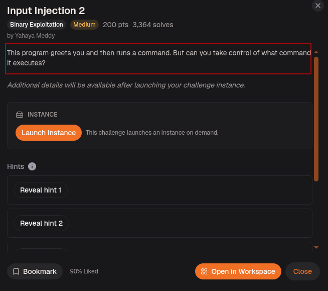
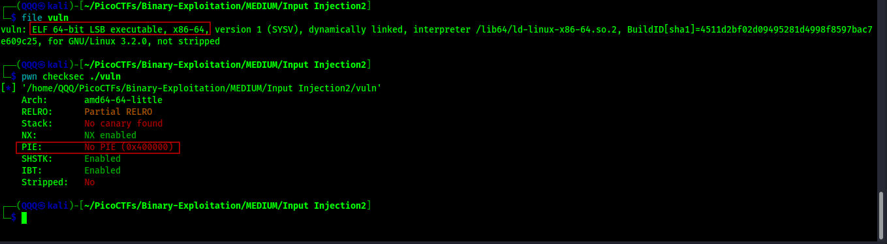
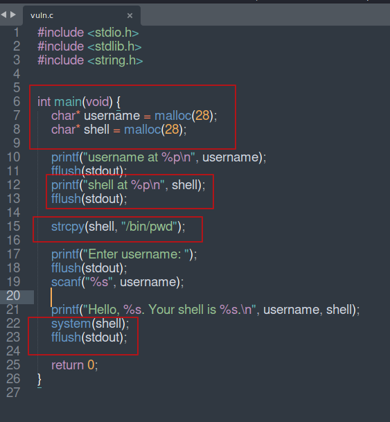
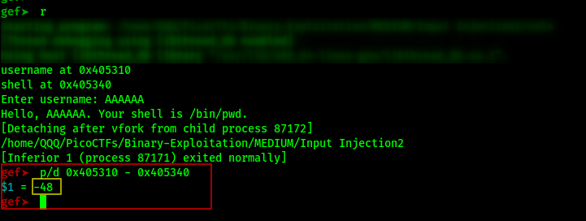
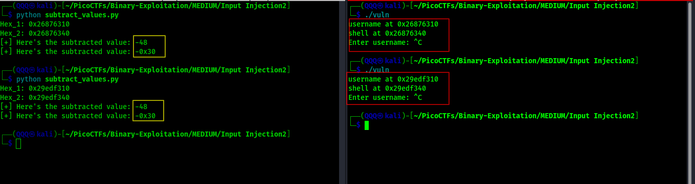
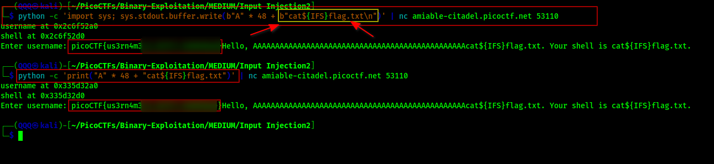
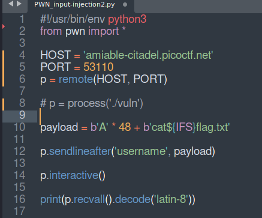
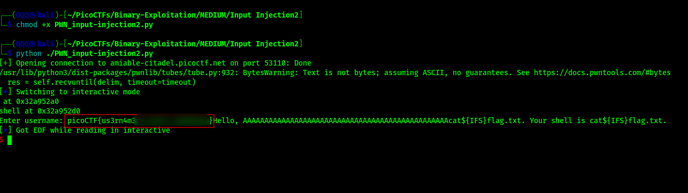
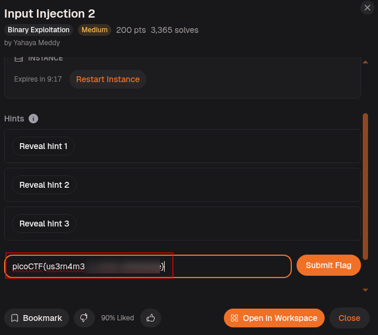

## Challenge Overview



> This program greets you and then runs a command. But can you take control of what command it executes?

At first glance, the challenge seems straightforward: a program greets us and then executes a command. But somewhere between those two actions lies an opportunity. Two neighboring heap allocations hold a secret, and if we can understand how they interact, we may be able to influence what command ultimately runs. There is one more obstacle waiting for us. Our input is restricted in a way that prevents a normal command from fitting. The solution will require exploring how shells interpret input and uncovering a clever workaround hidden in plain sight.


---

## Step-1: Setup

Ran `file` and `checksec` on the binary.



`ELF 64-bit`, No canary found, NX enabled, No PIE. Same protection story as Input Injection 1. No PIE means heap addresses are predictable relative to each other. No canary means the stack is unguarded, though that is not even the attack path here. The interesting detail is on the heap, not the stack.

---

## Step-2: Reading the Source



Four things to read carefully here.

Line 7: `char* username = malloc(28)` allocates 28 bytes on the heap for the username.
Line 8: `char* shell = malloc(28)` allocates another 28 bytes right after it on the heap for the shell command.

Lines 10 and 12: The binary prints both addresses out loud with `printf("username at %p\n", username)` and `printf("shell at %p\n", shell)`. It is telling us exactly where both buffers live in memory every single run.

Line 15: `strcpy(shell, "/bin/pwd")` loads the default command into `shell`. This is what `system()` will run unless we overwrite it.

Line 19: `scanf("%s", username)` reads our input into `username` with no size limit. `%s` in `scanf` stops at whitespace, meaning spaces, tabs, and newlines all terminate the input. Whatever we type gets copied into `username` starting at its heap address.

Line 22: `system(shell)` runs whatever is currently sitting in `shell`.

The vulnerability is the same pattern as Input Injection 1 but on the heap instead of the stack. `username` and `shell` are adjacent heap allocations. If we send more than 28 bytes into `username`, the overflow spills directly into `shell`, overwriting the command that `system()` is about to execute. We control what runs.

---

## Step-3: Finding the Offset

Loaded the binary in GDB and ran it with a short test input to observe the addresses.



The binary printed `username at 0x405310` and `shell at 0x405340`. We entered `AAAAAA` as a test, the shell ran `/bin/pwd` normally, and the process exited. Then we calculated the distance between the two addresses:

```
p/d 0x405310 - 0x405340 = -48
```

The result is `-48`. The negative sign just means `shell` is 48 bytes ahead of `username` in memory. So `username` starts 48 bytes before `shell`. We need exactly 48 bytes of padding to reach the start of `shell`, and whatever comes after byte 48 overwrites the command.

No cyclic pattern needed. No GDB crash analysis. The binary handed us both addresses and a single subtraction gave us the offset.

---

## Step-4: Double Checking the Offset

Ran the binary multiple times to make sure the gap between the two addresses is always 48 bytes.



Two separate runs on the right, two separate address pairs. On the left a small script subtracts the addresses each time. Both runs return `-48` and `-0x30` (which is the same value in hex). The distance between `username` and `shell` is always 48 bytes regardless of what the actual addresses are. Confirmed.

---

## Step-5: The ${IFS} Trick

Before building the final payload, there was one obstacle left to overcome. Our target command needed to contain multiple words, but the program reads input using `scanf("%s", username)`. That function stops reading as soon as it encounters whitespace. If we entered the command normally, only the first word would be stored and everything after the space would be discarded. The command that eventually reached the shell would be incomplete and useless.

At this point, it felt like a **dead end**. We spent some time experimenting, reading documentation, and searching for ways shells handle input behind the scenes. After a bit of digging, we stumbled across an interesting feature: **shell variables can sometimes be used to** **represent characters that would otherwise be difficult to pass through input restrictions.**

That discovery led us to `${IFS}`. In Bash, `IFS` stands for *Internal Field Separator*. By default, it contains the characters the shell treats as delimiters, including spaces. This meant we could write `cat${IFS}flag.txt` instead of `cat flag.txt`. The input contains no literal space characters, so `scanf` happily reads the entire string. Later, when the command is executed, the shell expands `${IFS}` and interprets it as a space, reconstructing the original command.

You can think of `${IFS}` as a disguised space. The program never sees an actual whitespace character, so the input passes through untouched. Once the shell gets involved, the disguise is removed and the command behaves exactly as if we had typed it with a normal space in the first place.

---

## Method 1: one-liner



```bash
python -c 'import sys; sys.stdout.buffer.write(b"A" * 48 + b"cat${IFS}flag.txt\n")' | nc amiable-citadel.picoctf.net 53110
```

This command uses Python to generate the payload and send it directly to the challenge server through Netcat. The expression `b"A" * 48` creates 48 `A` characters, which are used to completely fill the `username` buffer. After those 48 bytes comes `cat${IFS}flag.txt`, which spills into the neighboring `shell` buffer and overwrites the original `/bin/pwd` command. The `\n` at the end acts like pressing Enter, telling the remote program that our input is complete. Once the program later executes `system(shell)`, it runs our command instead of the original one.

```bash
python -c 'print("A" * 48 + "cat${IFS}flag.txt")' | nc amiable-citadel.picoctf.net 53110
```

This version achieves the same result but uses Python's `print()` function instead of writing raw bytes. Python prints 48 `A`s followed by `cat${IFS}flag.txt` and automatically adds a newline at the end. That output is piped into Netcat and sent to the challenge server. The first 48 characters fill the `username` buffer, while the remaining characters overflow into `shell`, replacing `/bin/pwd` with our command. When the program reaches `system(shell)`, it executes the overwritten command and prints the flag.

---

## Method 2: Automated with pwntools



The script connects directly to the remote host and port. The payload is built as 48 A's concatenated with `cat${IFS}flag.txt`. `sendlineafter` waits for the `username` prompt then fires the payload. `interactive()` catches whatever the program prints back.



Script ran, connection opened, payload sent, flag printed on the `Enter username:` line right next to the greeting.

---

## Step-6: Submitting the Flag




---

## Flag

```
picoCTF{us3rn4m3_***************}
```
> No more hints needed! We’ve reached the point where the binary and offset should carry you through. Go complete it, fella!

---

## What This Challenge Teaches

Input Injection 2 builds on its predecessor and adds two new concepts worth remembering:

* Heap allocations made back to back with `malloc` sit adjacent in memory just like stack variables do. Overflowing one spills into the next
* The binary printing its own heap addresses is not a courtesy, it is the vulnerability. Those addresses let us calculate the exact offset with one subtraction
* `scanf("%s")` is dangerous not only because it has no size limit but also because it stops at whitespace, which forces attackers to think about how to inject commands with spaces in them
* `${IFS}` is a bash expansion that substitutes the default field separator (a space) at runtime. It lets you smuggle a space past input functions that reject whitespace, because the space does not exist in the raw bytes, only in what bash interprets after the fact
* Any time a program passes user-influenced data to `system()`, the question to ask is: can I control what reaches that call?