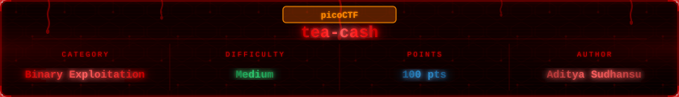

---

## Challenge Overview

> You've stumbled upon a mysterious cash register that doesn't keep money, it keeps secrets in memory. Traverse the free list and find all the free chunks to get to the flag.

The challenge tells you exactly what to do. The binary allocates chunks on the heap, writes the flag into the last one, then frees them all. The tcache free list links them together in order. Our job is to read the head address the binary leaks, calculate where every chunk lands, and feed those addresses back one by one to prove we traversed the list.

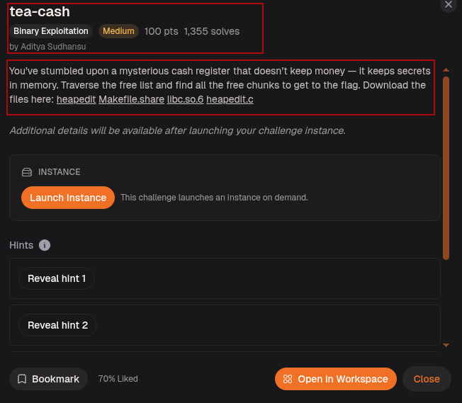

---

## Step-1: Setup

Ran `file` and `checksec` on the binary.

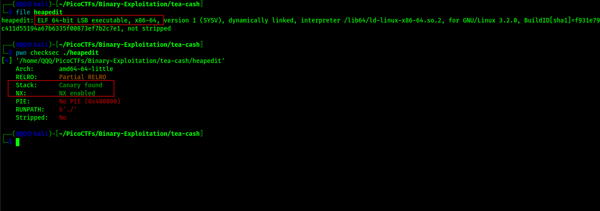

We’re looking at a `64-bit ELF` with NX enabled, a stack canary, and no PIE. The important part is that without PIE, the binary always maps to the same address in memory. While the canary protects the stack, this challenge doesn’t rely on stack overflows at all. Instead, everything revolves around the heap, where the layout is predictable and the program conveniently leaks the tcache head, giving us the initial pointer we need.

---

## Step-2: Reading the Source

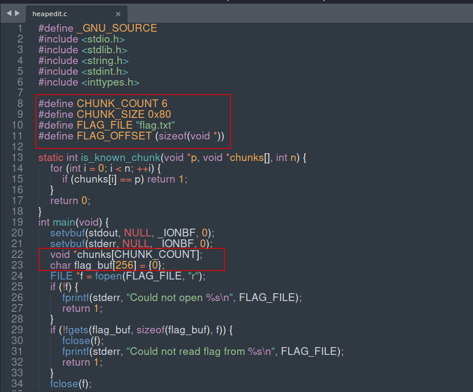

We create 6 memory blocks (called chunks), and each one is 0x80 (128 bytes) in size. The program stores the addresses of these chunks in an array called `chunks[]`, so it can keep track of where each block is in memory.

It also reads the flag from `flag.txt` and stores it in a buffer called `flag_buf`. Since this is a 64-bit system, pointers (memory addresses) are 8 bytes long, so `FLAG_OFFSET = sizeof(void*) = 8`, meaning we skip 8 bytes when placing the flag inside memory.

After each chunk is created using `malloc`, the program uses `memset` to fill it with zeroes so that every chunk starts off completely empty and clean before anything is written into it.


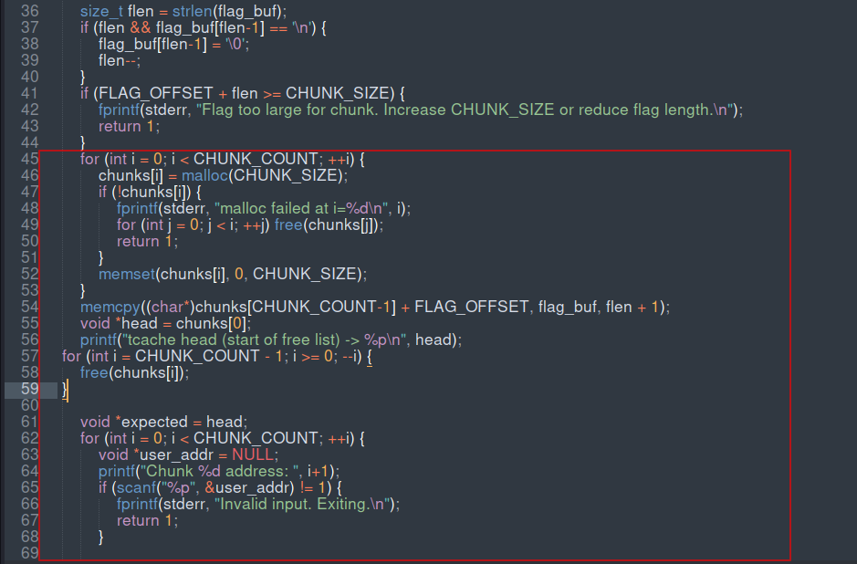

After allocation, the flag is copied into the last chunk at offset `FLAG_OFFSET`. Then `head` is set to `chunks[0]` and the binary prints `tcache head (start of free list) -> <address>`. All 6 chunks are then freed from last to first. When chunks are freed into the tcache, each freed chunk stores a pointer to the next free chunk at its own address. So after all frees the tcache list goes from chunk 0 forward through chunk 5 in order.

Then the binary loops 6 times and asks us for `Chunk N address:`. For each input it reads our address, checks it against `expected`, reads the `next` pointer stored at that address, and advances `expected` to `next`.

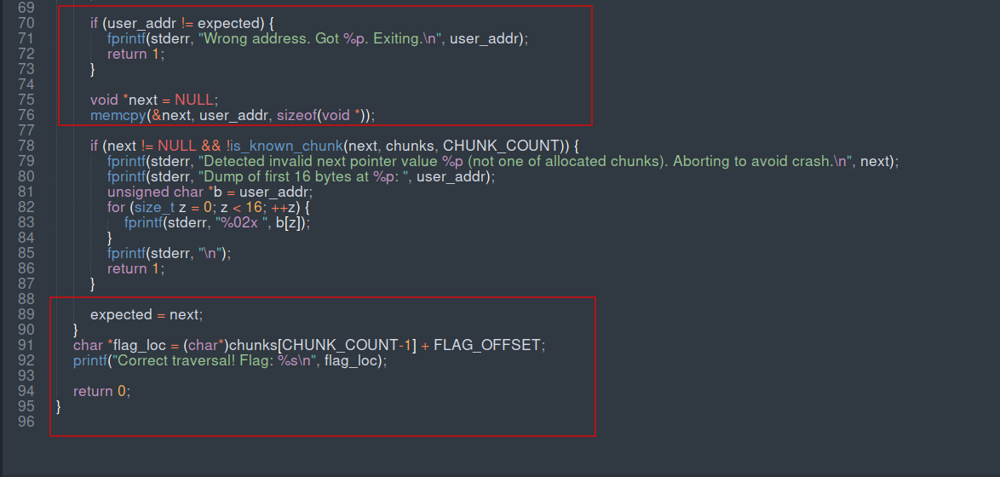

If our address matches `expected` at every step the traversal is correct. Once all 6 addresses are accepted, `flag_loc` is computed as `chunks[CHUNK_COUNT-1] + FLAG_OFFSET` and the flag is printed. If any address is wrong the binary exits immediately.

---

## Step-3: Understanding the Chunk Layout in GDB

Loaded the binary in GDB and ran it to see the leaked head address.

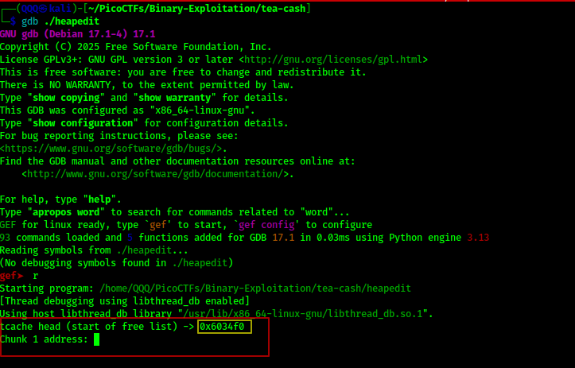

The binary printed `tcache head (start of free list) -> 0x6034f0` and waited for chunk 1 address. Used GDB to inspect that chunk.

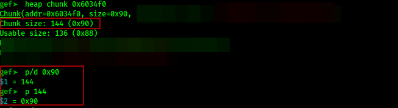

`heap chunk 0x6034f0` shows `Chunk size: 144 (0x90)`. Confirmed with `p/d 0x90` which equals 144 decimal. So each chunk occupies `0x90` bytes of heap space even though `CHUNK_SIZE` is `0x80`. The extra `0x10` is the malloc metadata header that sits in front of every chunk. So the gap between consecutive chunk addresses is `0x90`.

---

## Step-4: Calculating the Addresses

Wrote a small helper script to do the math automatically.

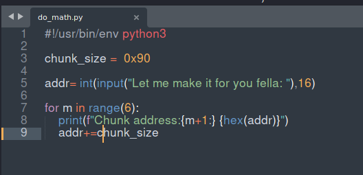

The script takes the leaked head address as input, then loops 6 times printing each chunk address by adding `0x90` at each step.

Ran it against the remote instance.

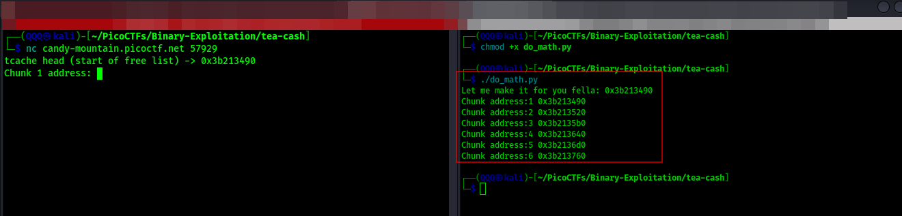

Connected to the remote on the left, got the leaked head `0x3b213490`. Fed it into `do_math.py` on the right. The script calculated all 6 addresses instantly:

* Chunk 1: `0x3b213490`
* Chunk 2: `0x3b213520`
* Chunk 3: `0x3b2135b0`
* Chunk 4: `0x3b213640`
* Chunk 5: `0x3b2136d0`
* Chunk 6: `0x3b213760`

Entered them one by one into the remote.

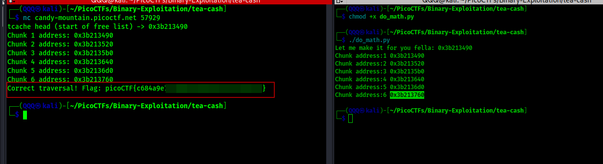

Flag printed immediately after the last address was accepted.

---

## Method 2: Automated with pwntools

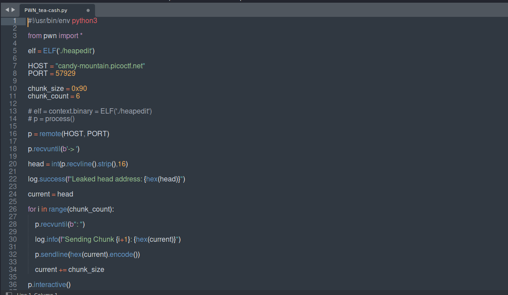

The script connects to the remote host and port, waits until it receives `-> ` to catch the leak line, reads the next line and parses it as a hex integer to get `head`, sets `current = head`, then loops 6 times. Each iteration waits for the `address: ` prompt, sends the current address as a hex string, and increments `current` by `0x90`. After the loop it drops into interactive mode to catch the flag output.

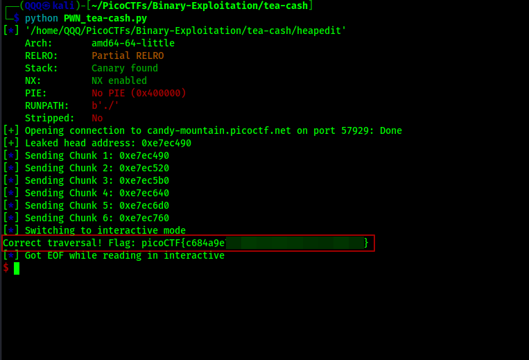

The script leaked the head address, sent all 6 chunk addresses automatically, and the flag printed.

---

## Step-5: Submitting the Flag

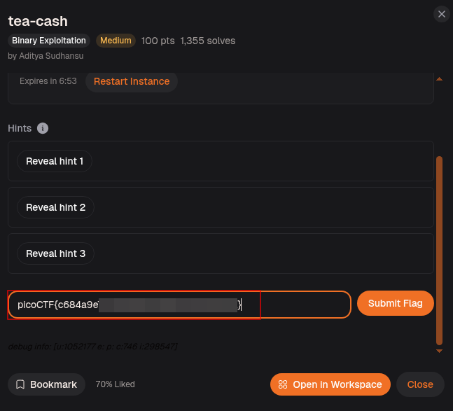


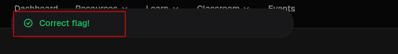

---

## Flag

```
picoCTF{c684a9e_REDACTED}
```
> I’m not spoiling the grand finale 😄 You already have the binary and the chunk size, now it is the time to let your brain do the victory lap.
---

## What This Challenge Teaches

tea-cash is a hands-on introduction to how the tcache free list works:

* When chunks are freed into the tcache, each one stores a forward pointer to the next free chunk at the start of its user data region
* The binary leaks the head of the free list which is enough to reconstruct every subsequent address because the spacing between chunks is fixed
* Each chunk occupies `CHUNK_SIZE + 0x10` bytes on the heap because malloc prepends a 16-byte metadata header to every allocation
* No PIE and a known chunk size means the entire free list can be calculated with simple arithmetic
* Traversing the free list manually is exactly what a heap allocator does internally every time it hands out memory