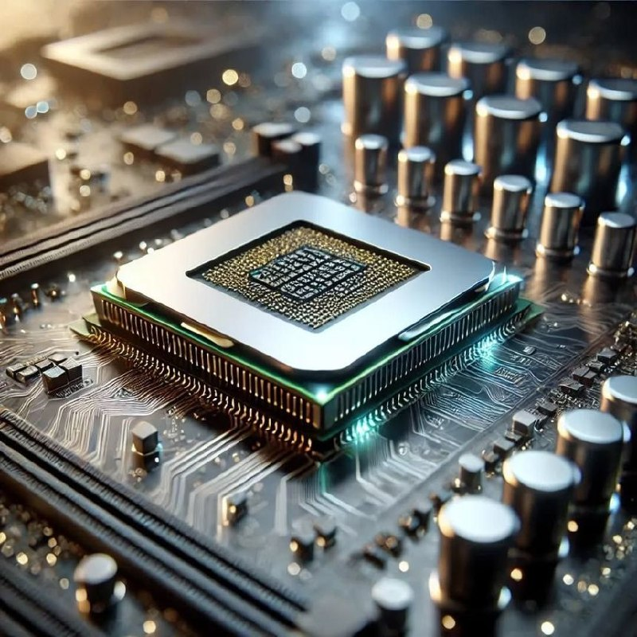
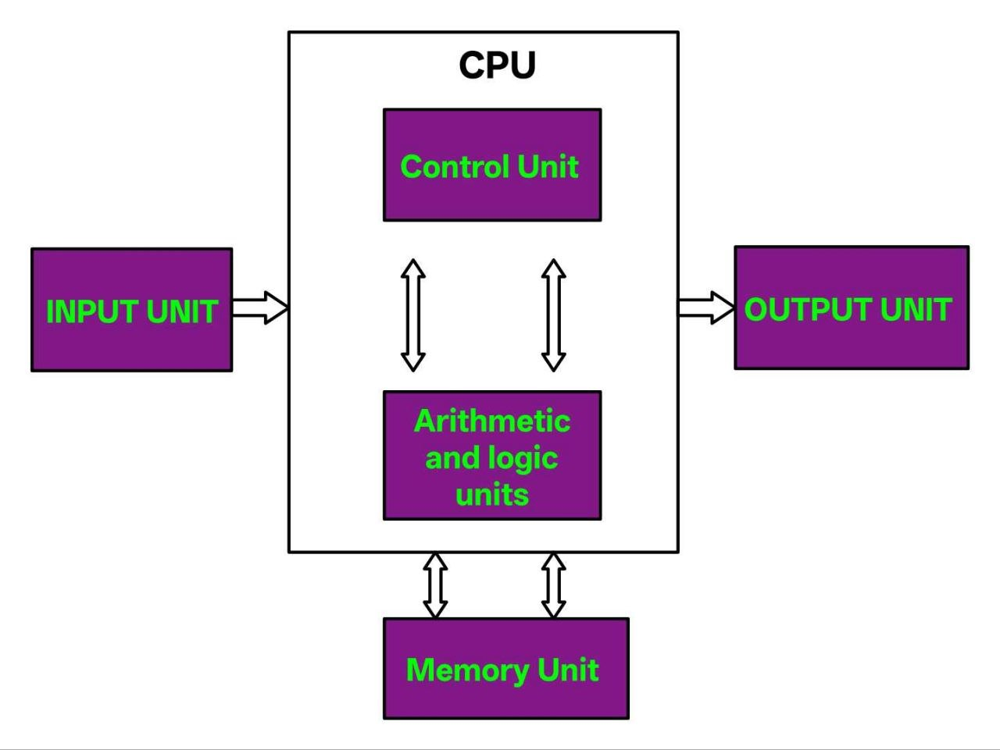
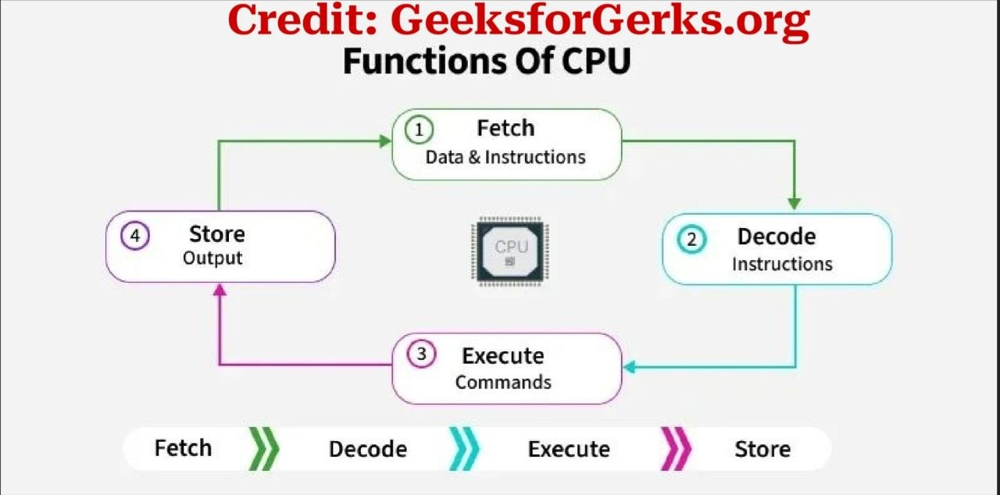

# 1: Qaab dhismaydka computer-ka (Computer architecture) 
 
 **● 1: CPU**

**Hordhac:**
Waxaa lama huraan ah in aan markale kusoo celiyo sababtu-na waa muhiimada ay arintaas leedahay'e, in Taxanahaan 'Core-Concepts-for-Binary-Exploitation' uu aad iyo aad muhiim ugu yahay fahamka sida loo sameeyo (Binary-Exploitation CTFs) maxaa yeela "Binary-Exploitation" ma sameen kartid adigoo aan aqoon u lahayn waxyaabaha asaasiga ah sida (CPU, Memory, C/C++ language, Assembly language) iyo wixii la halmaala ah.


**Fiiro gaar ah:**

Qormadaani waxa ay qaab kor kaxaadis ah oga hadli doontaa CPU-ga, si kastoo ay ahataba hadii aad dooneesid in mowducaan si qoto dheer aad u baartid waxaan hoos kuugula wadaagi donaa (Resources) aan isku soo aruuriyay oo ka kooban Qormooyin iyo Youtube videos. waxaad ka heli kartaa qeybta "Resources-ka".

**Qodobada aad ka dhex heli doontid qormadaan:**

Jawaabta 1: Waa maxay **CPU**?

Jawaabta 2: Maxuu qabtaa?

Jawaabta 3: Imisa qeyb ayuu ka kooban yahay **CPU-ga**?

Jawaabta 4:Qaab nuuce ah ayuu **CPU-ga** u shaqeeyaa?

Jawaabta 5: Muhimad nuucee ah ayuu leeyahay Computers-ka Mobiles-ka I.W.M?


**J1: Waa maxay CPU?**

Tusmada 1:



---
CPU oo loo soo gaabiyay **(Centeral process unit)** hadii aan si fudud kuugu sheego waa **'maskaxda'** Computer-kaaga, Mobile-kaaga marba hadii uu maskaxda yahay-na waxa aay ka dhigan tahay in uu kamid yahay qaybaha Computer-ka i.w.m ay ka koobanyihiin kuwa ugu muhiimada badan hadii uusan ahaynba kan ugu **muhiimsan.**

**J2:Maxuu qabtaa?**

Waa mas'uulka shaqooyinka system-kaaga uu qabto ee badanaa **daaha gadaashiisa** ka socda. Bal halmar ila arag waxa uu CPU-ga qabto tusaalaha hoos ku xusan.


Tusaale: 
Markaad furto browser (Chrome - firefox - brave I.W.M) midka uu rabo ha ahadee
Waxa dhaca shaqooyin xarxariira oo taxane ah kuwaasi oo kala ah: 

**1: Guujinta browser-ka**
▪︎ waxa aad guujisaa icon-ka browser-ka 
▪︎**CPU-ga** ayaa asna waxa uu bilaabaa in uu code-ka ama habka dadkii soo diyaariyay barnaamijka sida aay ugu talagalayn iyo waxa aay ugu tala galayn in la isticmaalo.


**2: Furista website-ka**
▪︎ Qaybata Search-ga ayaad waxaad ku qortaa 
**(tusaale: www.FuzzRaiders.com)**

▪︎**CPU-ga** ayaa Farsameeya
xogta meeshas aad gelisay, xogtaasina waxa ayaa loo matalaa wax loo yaqaan "Binary" oo ah **(base 2)** taasi oo micnahedu yahay kaliya in uu ka koobanyahay **labo qiimo** oo kaliya labdaasi oo kala ah **(0 iyo 1)**

**Faaiido kooban:**
"Computers-ka kaliya waxa ay isticmaalaan oo ay ku shaqeeyaan 0(eber) iyo 1(hal)"  
Haa, kaliya 0 iyo 1.

▪︎ Shaqadaas kadib CPU-ga waxa uu codsi u diraa internet-ka

**1: Helitaanka xogta**

▪︎ Website-ku wuxuu kuu soo diraa:
HTML --> qaabka bogga
CSS --> naqshadda iyo midabada
JavaScript -->  hawlaha iyo dhaqdhaqaaqa

**4:Farsamaynta bogga (Process the page)**

▪︎ CPU-ga ayaa akhriya oo fuliya code-kii uu ka helay website-ka.

▪︎ Wuxuu dhisaa bogga iyo wixii soo raaca.

**5:Muujinta (Display-ga)**

▪︎ CPU-ga wuxuu la shaqeeyaa GPU **(Graphical processing unit)**
Si uu u soo bandhigo sawirka shaashadda (screen-ka)

▪︎ Adi kaliya waxaad aragtaa uun website-kii oo furmay, balse waxa aynu kor kusoo xusnay iyo kabadan ayaa ah shaqada **daaha gadaashiisa kasocata** ee uu CPU-ga iyo kuwa kale ee kuu qabanayaan. 
Mhdsanid CPU.

**Shaki inoogama jidho ayaan u malaynayaa in CPU-ga uu aad iyo aad u xawaare sareeyo hadiiba shaqadaas aan kor kusoo xusnay iyo kabadan uu ilbidhiqsiyo ama ka yarba gudohooda uu ka qabanaayo.**


**J3:Imisa qeyb ayuu ka kooban yahay CPU-ga?**

Dabcan waa ay badan yihiin, balse kuwa ugu muhiimsan hadii aan ka xusno waxa ay kala yuhiin sida sawirka hoos kaaga muuqda: 
  
Tusmada 2: 


---
   **1: CU (Control unit)**

▪︎ Waxa ay maamusha wax waliba oo kadhax dhacaya CPU-ga dhaxdiisa.

▪︎ waxa ay qaybaha kale ee CPU-ga u sheegtaa howsha la qabanaayo iyo goorta.
**Yacnii Waa sida Taliyaha ciidanka oo kale.**
  
   **2: ALU (Arithmetic and logic units)**

▪︎ Shaqadaydu waa:

 * Xisaabaadka sida ku dar "+",
ka jar "-", isbarbardhigid " > < = " : i.w.m.
 
 * Mandiqa (logic-ka) sida 
shay run ahaanshihiisa ama been ahaanshihiisa.
Mid hadii u noqdo marnaba lagama yaabo in uu noqdo midka kale.
  

**3: Memory (Registers iyo cache)**

▪︎ Xogta, awaamirta iyo i.w.m ayee si kumeel gaar ah u keediyaan inta CPU-ga uu shaqaynaayo.


**J4: Qaab nuuce ah ayuu CPU-ga u shaqeeyaa?**

Central process unit-ka waxa uu racaa hab loogu yeedho **"instruction cycle"** ama loo garan ogyahay **"fetch -> decode -> execute cycle".** Hoos ayaad ka eegi kartaa flow chart/diagram hadii aa tahay qof aragti wax ku barta.
Tusmada 3:



```
Fetch → Decode → Execute → Store → kusoo celi 

Fetch → Decode → Execute → Store → kusoo celi
```
Sida aad erayada iyo sawirada kor kuxusanba aad ka dhadhansan kartid waxa meesha ka socdo waa "iska daba wareeg aan joogsaneyn" ilaa u CPU-ga shaqada ka joojiyo.

**J5: Muhimad nuucee ah ayuu CPU-ga uleeyahay Computers-ka, Mobiles-ka I.W.M?**

▪︎ CPU la'aantiis, Computer-kaaga ama Mobile-kaaga wax software ah ba kuuma shaqeeyeen iskaba daa in uu software kuu shaqeeye **maba soo daarmeenba/shidmeenba aslan**

▪︎ Computer/Mobile bilaa CPU ah **waa sida jidh bilaa ruux ah!**


---
# Resources:

### Qormooyin:
- [CPU Overview – GeeksforGeeks](https://www.geeksforgeeks.org/computer-science-fundamentals/central-processing-unit-cpu/)
- [What is a CPU – Lifewire](https://www.lifewire.com/what-is-a-cpu-2618150)
- [CPU Explained – freeCodeCamp](https://www.freecodecamp.org/news/what-is-cpu-meaning-definition-and-what-cpu-stands-for/)
- [How a CPU Works – Medium](https://medium.com/@DavidGuymon/how-a-cpu-works-and-why-we-say-its-the-brain-of-a-computer-ac6a6b920067)

### Youtube Videos:
- [CPU Explained (Video 1)](https://youtu.be/Z5JC9Ve1sfI)
- [CPU Explained (Video 2)](https://youtu.be/GtVDTp826DE)
- [CPU Explained (Video 3)](https://youtu.be/tadUeiNe5-g)
- [CPU Explained (Video 4)](https://youtu.be/cNN_tTXABUA)


