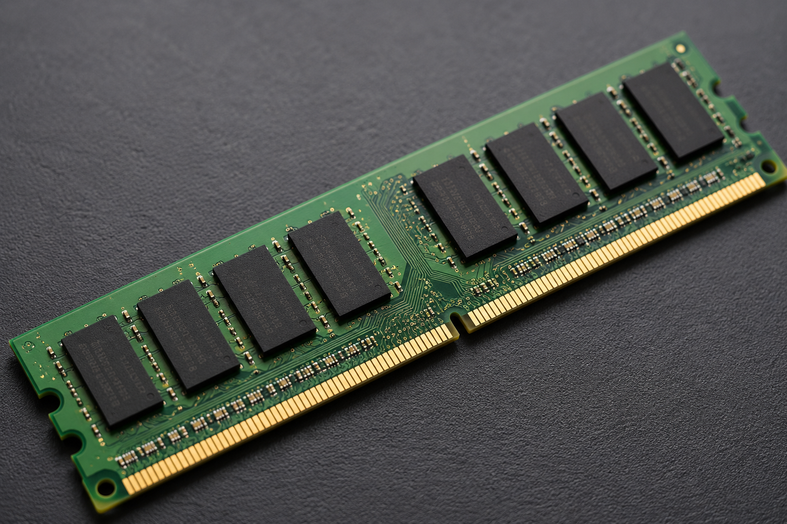
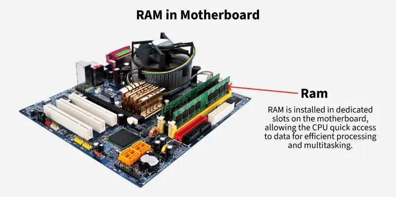
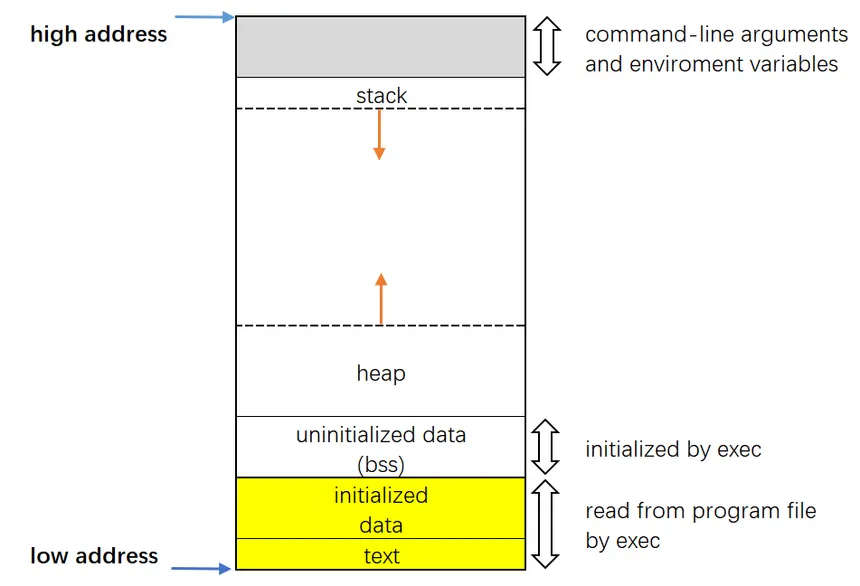
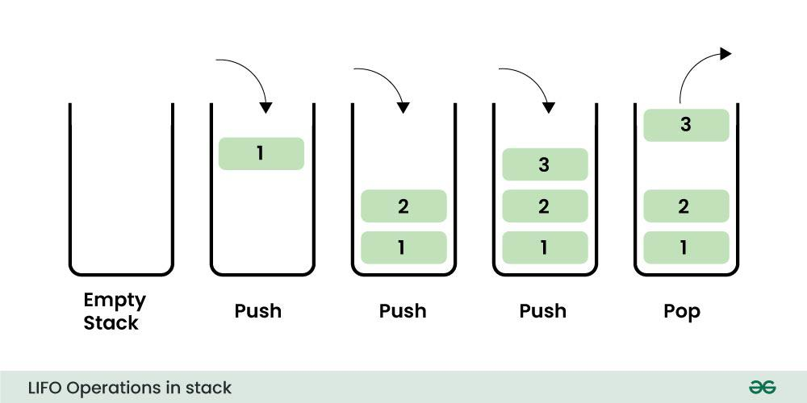

 
 # ● 2.1: Memory & Memory layout 

Tusmada 1aad:




Waan ogahay aqriska badan in aadan jecleen sidaa aawgeed aan muhiimada hore usii guda galno!

**Mowduucyada aad qormadaani ka dhaxheli doonitid waa sida xiga:**

* 1: Qeexida Memory-ga 
* 2: Qaab dhismeedkiisa
* 3: Muhiimad nuuce ah ayee aqoonista Memory-ga u leedahay Binary-Exploitation-ka 
* 4: Gunaanad
* 5: ilo aad ka heli kartid macluumaad dheeraad ah (Resources)

# 1: Qeexida Memory-ga
  
 * Memory-ga waa qeyb kamid ah Computer-ka/Mobile-ka i.w.m kaas oo keediya xogta iyo amarada **si CPU-ga uu u isticmaalo.**
---

**Tusaale:**

Waxaad leedahay oo aad heesataa "Sanduuq", "Armaajo" ama wixii lamid ah, kaasi oo aad **ku keedsatid alaab adiga muhiim kuu ah sax?**
waayahaye hadii ay howsha sidaa tahay **Shaygaas aad alaabta ku ridatay ama aad ku ridatid wuxuu noqonaa Memory-ga, adigana waxaad noqonaysaa CPU-ga. Cafwan waa tusaale uun, ha iga caroon.**

---

# 2:Qaab dhismeedkiisa
Waaa muhiim in aan kula sii wadaago in aaynu wada xusi doonin Memory-ga qebihiisa kala duwan ee aan kaliya kala soo dhaxbixi doonno, inta naga caawinaysa aadna muhiimka ugu ah fahamka **Binary-Exploitation.** Adigoo arrintaas maanka ku haya aan u gudubno *RAM-ka*.

**RAM-ku (Random access memory)** dabcan, waa qeyb kamid ah Memory-ga taasi oo xogta si **kumeel gaar ah u keedisa si CPU-ga iyo kuwa la halmaala ay xogtaas sida ugu dhaqsiyaha badan uu isticmaalaan.**
Waa lami sii arkaan oo micnahedu yahay **in xogta ku jirto RAM-ka la heli karo kaliya inta Computer-ka/Mobile-ka uu shidan (power on) yahay hadii mar uu damo oo (power off) noqdo helitaanka xogtii halkaas ku jirtay waxaa ka dhaw cirka!

 Tusmada 2aad:             



**Tusale:**

Waxaad dareentay gaajo in ay ku heyso, waad istaagtay oo jidkada ayaad gashay si cunto aad usoo karsatid
hagaag aynu dhahno Waxyaabihii aad cuntada ku karsan laheed waxay ku jidhaan armaajoooyinka jikada ku yaalo 
ama meel uun ayee ku xareesanyihiin. Midka ay ahaataba waad lasoo baxday walxihii sida (Xawaashka, Tuunta, Maraq digaagta i.w.m) waxaad soo dhigatay meesha aad cuntada ku karineesid agteeda si isticmaalkooda ay kuugu sahlanaadan.

Marka:
 * Memory-ga waa sida armaajooyinka/meelaha (Xawaashka i.w.m) ay ku keedsan yihiin 
 * RAM-kuna waa sidii meesha aad cuntada ku karineesid agteeda(Yacnii waxaad u baahantahay Xawaashka I.W.M, in aad si dhaqsi ah aad u heshid sidaa aawgeed waxa ay noqonaysaa in marka horyba meel dhaw in aad soo dhigatid)
 * adiguna markale waxa tahay sida CPU-ga oo kale.

**Si kooban**
RAM-ka waxuu caawiye/gacanyare u yahay CPU-ga. wuxuu soo diyaariyaa oo meel dhaw usoo dhigaa xogta, amarada, iyo waxwaliba oo CPU-ga uu bahanyahay si oo sida ugu dhaqsiyaha badan oo u helo.

---
## Memory layout:

Tusmada 3aad:



**Fiiro gaar ah:** Qeeybintaan kor kuxusan waxa ay aad usii gaar tahay luqadaha C iyo C++!

Sida "Tusmada 3aad" aad ka arki kartid Memory layout waxuu uu kala qeebsan yahya sida xigta:

* 1.Stack: 

1.1: Marwaliba Stack-ka wuxuu joogaa **Higher memory address** (sida sawirka kor kuxusan aad ka arki kartid).
1.2: Waxuu keediyaa **Local variables, Function parameters iyo return addresses-ka oo function waliba uu u yeedo.**
1.3: Waxa uu u koraa/weenaadaa dhinaca Heap-ka oo ah **(lower address-ka)** maadaama Heap-ka uu Stack-ka ka hooseeyo.
1.4: Qaab dhismeedka Stack-ka waa **LIFO (Last-in-first-out) yacnii shayga ugu danbeeya ee gala ayaa ah kan ugu soo horbaxa!**

**iyadoo Sawir ah hoos ka fiiri!**

Tusmada 4aad:



```
Push = gili 
Pop  = bixi
```
Sida "Tusamada 4aad" aad ka arki kartid **tirada saddax oo eheed midii ugu deenbeesay ee soo gasha ayaa eheed tii ugu horeesay ee baxda.**

* 2.Heap:
2.1: Waa halka dynamically allocated memory ay dagan tahay 


---

**Codsi:**

Waan ogahay Memory layout xaqqeda oo dhameestiran in aanan siinin ee waxaan ka codsanaa 
in si qoto dheer aad usii baartid oo aad faham fiican aad u yeelatid qeybaha kala duwan ee Memory layout-ka
Mhdsanid!

---

# 3: Muhiimad nuuce ah ayee aqoonista Memory-ga iyo Memory layout-ka u leedahay Binary-Exploitation-ka

Aqoon u lahaanshaha Labada kor kuxusan kaliya ma ahin wax faaido u leh fahamka Binary-Exploitation ee, **Waa udub dhaxaadka/tiirarka Binary-Exploitation uu ka dhisan yahay kan ugu muhiimsan. 


# 4: Gunaanad:

Mahadi hakaa gaarto waqtiga aad ku bixisay aqrinta qormadaan, Eebana haka ajir siiyo inshaa Allah.
## Resources:

Qormooyin:

1: https://www.geeksforgeeks.org/computer-science-fundamentals/random-access-memory-ram/

2: https://americas.lexar.com/what-is-ram/

3: https://medium.com/@dwivedi.abhijeet1301/ram-random-access-memory-8a450774f493 (inaba caadi ma ahin)

4: https://medium.com/@sunnybabacom10/ram-a-deep-dive-into-its-importance-types-and-functionality-c042a095ef95

5: https://www.geeksforgeeks.org/c/memory-layout-of-c-program/

6: https://medium.com/@shoheiyokoyama/understanding-memory-layout-4ef452c2e709

7: https://www.tutorialspoint.com/cprogramming/c_memory_layout.htm

8: https://www.wscubetech.com/resources/c-programming/memory-layout (Faaiido badan ayaa ku jirta kan)

9: https://medium.com/@vivekkr1020/memory-layout-in-c-87f8b8c67fc5

Youtube Videos:

1: https://youtu.be/2htbIR2QpaM?si=m2AwSji1Vv4llXcf

2: https://www.youtube.com/live/kcRdFGbzR1I?si=8g2AEPTpn8WrEhLh

3: https://youtu.be/rJrd2QMVbGM?si=HhsCA1TpV8IEzBok

4: https://youtu.be/MKwe8WVJVzM?si=jDSps6IPRlYEiZU7

5: https://youtu.be/_D8eLCmlrS8?si=K3L-3RJUj9lLhWIE


