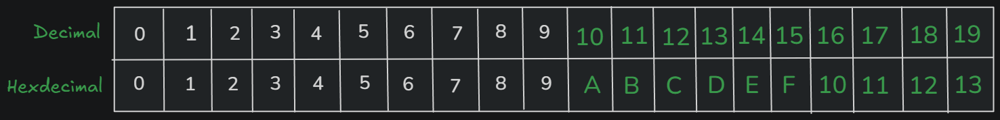
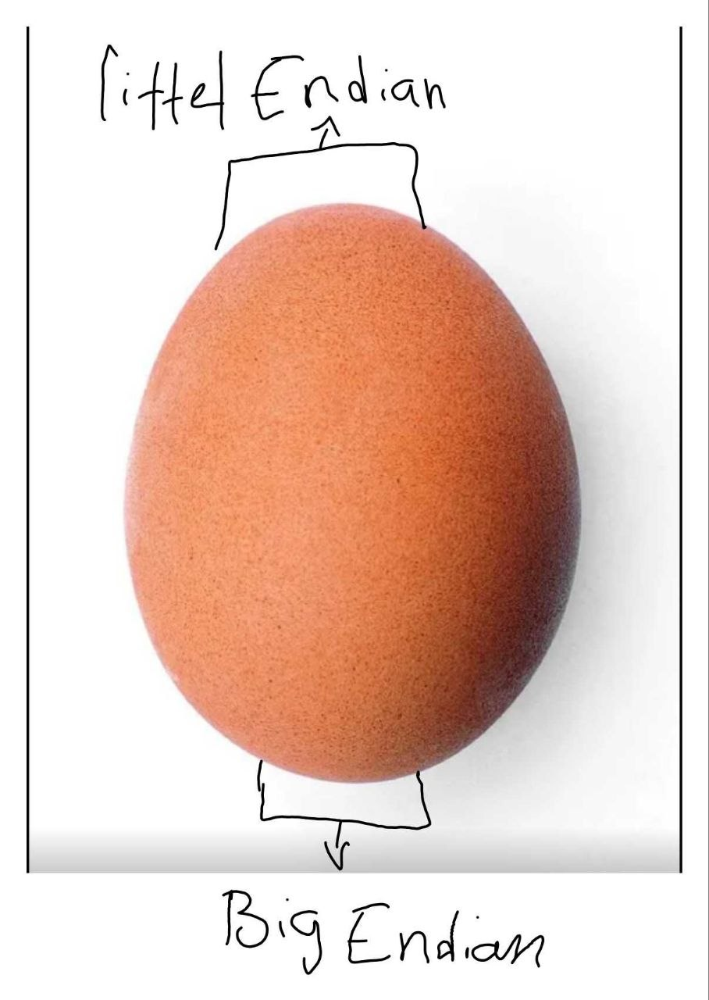
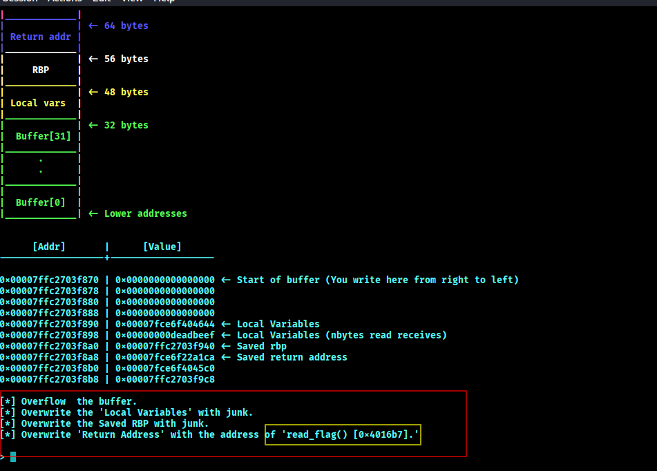
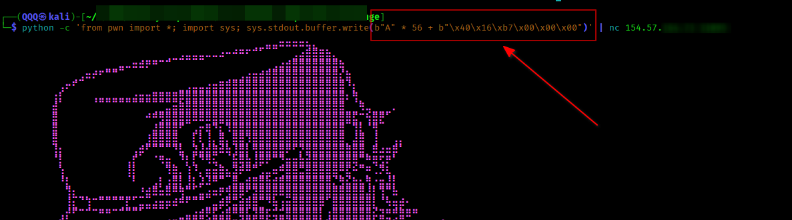
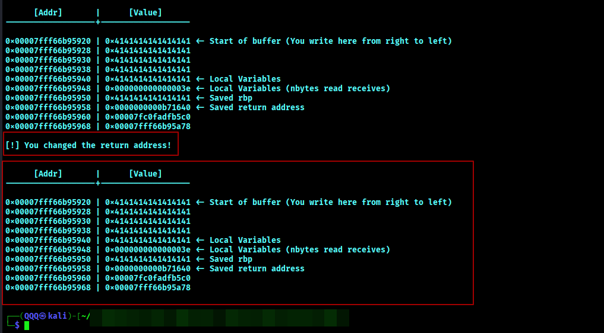
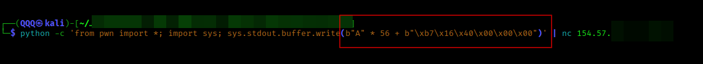

 # ● 2.2: Hexadecimal, Addressing & Endianness

> Isku soo laabasho wacan saaxib!


Waxaan aaminsahay qormadaan in ay ku xiiso gelin doonto maxaa yeelay waxaynu ka hadli donna wax caadada yacnii sida aan la qabsanay ka baxsan ina mari aynu isla arganee waa maxay?

**Mowduucyada aad qormadaani ka dhaxheli doonitid waa sida xiga:**

* 1:Hexadecimal maxuu yahay
* 2:Addressing iyo mudhiimada uu leeyahay Caalamka Computer-ka 
* 3:Waa maxay Endianness maxaysa tahay faiidada barashadeeda inoogu jirta?


**1:Hexadecimal maxuu yahay?**

Hadii aad horay u aragtay "0x416D616C" ama "0xFFFFFFFF" ama "0xDEADBEEF" ugu badnaan waad isweediisay waxani maxay ahayeen? ma luqad jin baa mise?

Waxaasi waa Hexadecimal oo loo garan ogyahay "Base-16" ama loo soo gaabiyo "hex" waa nuuc kamid ah qaab numbereedyada kala duwan ee jira sida 
* Binary oo ah base 2 kaliya laba qiimo ayuu leeyahay (0 iyo 1).
* Octal oo ah base 8 asna 8 qiimo ayuu leeyahay oo ah (0 ilaa 7)
* Decimal oo ah base 10 waa midka aynu wada garanayno Qimihiisu waa (0 ilaa 9)
* Hexadecimal oo ah base 16 asigana 16 qiimo ayuu leeyahay ( 0 ilaa F )
> Waa ogahay wllo, waa lagu dawaqi waxaan balse, haka walwalin kan ugu dambeeya asigoo faahfaahsan ayaad hosi ugu tagi hadii uu Eebbe idmo. 

Aan tusaala ahaan usoo qaadano qaab Numbereed aan wada garaneeno kaasi oo ah "base-10/decimal" kadibna is-barbardhig aynu samayno.

Tusmada 1aad:

<p align="center">
  <b>By Author</b>
</p>


Haa, sida aad aragtay waa sax Xarfaha waxa ay halkaani ku matalaan tirooyin 
```
0xA = 10 
0xB = 12
0xC = 13
0xD = 14
0xF = 15 
0x10 = 16
.
0x19 = 25
0x1A = 26 
0x1B = 27
```

***Maadaama aad xogtaas soo ogaaday ma ii ogalana kartaa hal su'aal in aan ku weediiyo?**

**Mahadsanid, tirada "10" qiimahaydu waa imisa? Aqriska wax yar ka naso oo jawaabta ka fikir sida aad u maleenesid uma fududa!**

Waa wareer soomaha? hortaa bay ilmo yar yar ciro kasoo bixisay su'aashas 
```
"10-ku" ma Tobankii Decimal ahaay baa oo qiimahiisuna ahaa 10 
mise waa "10-kii" Hexadecimal oo qiimahiisu ahaa 16?

```


Madax xanuunka aad waxyar kahor soo aragtay ma ahan mid loo dulqaadan karo wareerkaas-na ma ahan mid la xamili karo sidaa aawgeed ka banii aadam ahaan dabacadaynu baa waxa ay tahay shay waliba wax lagu aqoonsado in aan u yeelno
bal qiyaas waxa soo socda??

Waad saxantahay Hexadecimal waxaa loo yeelay wax lagu garto kaasi oo ah
**(0x)**.
0 --> waa boos celiye
x --> waxa uu tilmaamaya waxa soo socda in uu yahay Hexadecimal uusan wax kale eheen 

Marka 
``` 
10 = 10 marki la joogo Decimal

0x10 = 16 marki la joogo Hex 

```

**Qaacida gaaban oo kooban:**

* Marwaliba aad aragtid "0x" waxa ka danbeeya waa Hex/base16

Tusmada 2aad:


**2:Addressing iyo mudhiimada uu u leeyahay Caalamka Computer-ka.** 

Addressing waa:

● Tiirarka Caalamka computer-ka uu ku taaganyahay kuwa ugu muhiimsan mid kamid ah. 

● Waxaa loo isticmaalaa si si gaar ah oo loogu ogaado xogta, Awaamirta I.W.M halka ay ku keedsanyihiin kadibna loola soo baxo xogtaas lana isticmaalo. 

● Waxa uu Computer-ka si cad ugu sheegaa halka uu xogta ku diraayo marka uu rabo in uu diro iyo halka uu ka helaayo xog uu rabay. 

● Addressing la'an Computer-ka dhanba wuu iskudhaxyaac sami lahaa oo ma garan laheen meel uu wax ku diro iyo qaab uu wax ka helo iyadoo meesha iskudhaxyaac eesab noqon. 

**Tusaale: Memory (RAM)**

Xog kasta oo RAM-ka ku jirta waxay leedahay address u gaar ah. CPU-gu address-kaas ayuu adeegsanayaa si uu xogta saxda ah u helo.
• Address 0x0012 -> waxaa ku jira xog gaar ah.
• CPU-gu markuu xogtaas  rabo, address-kaas ayuu toos u raadiyaa.


**3:Waa maxay Endianness maxaysa tahay faa'iidada barashadeeda inoogu jirta?**

Waxaad soo ogaatay in Computer-ku xogta ku kaydiyo Memory-ga (RAM) isagoo adeegsanaya addresses si uu xogta u kala garto. Laakiin hal su'aal ayaa imaanaysa:

```
Hadii xogtu ay ka koobantahay wax ka badan hal byte,
sidee ayuu Computer-ku u kala dhigaa?

```

Kahor inta aynaan sii guda gelin, bal aynu fahanno waa maxay **byte**?

"Byte" waa unug xogeed uu Computer-ku isticmaalo waxaana uu ka koobanyahay:

```text
8 Bits
````
marka 8 bits waxa ay udhigantaa 1 byte

Bit-na waa:

```text
0 ama 1
```

Tusaale ahaan:

```text
01000001
```

waa 8 bits oo marka la isku geeyo noqonaaya:

```text
1 Byte
```

Computer-ku inta badan xogta uu ku shaqeeyo kaliya kuma koobna "bit" uun, balse waxa uu sidoo kale ku shaqeeyaa bytes sababtoo ah waa qaab fudud oo xog badan lagu maamuli karo.

Tusaale:

* Xaraf sida `A` → 1 Byte
* Tiro sida `0x41` → 1 Byte
* `0x12345678` → 4 Bytes

Taasi waa meesha ay Endianness kasoo galayso.

Marka xogtu ka koobnaato bytes badan, Computer-ku waa inuu go'aamiyaa:

```  
Byte-kee ayaan marka hore memory-ga dhigaa?

```

Endianness waa qaabka uu Computer-ku u kala hormariyo bytes-ka xogta marka lagu kaydinayo memory-ga.

Waxaa jira labo nuuc oo kala ah:

* Little Endian waa sida Af-carabiga oo kale aqriska dhanka midig ayaa laga soo bilaa dhanka bidix ayaa loo wadi.
* Big Endian kanina waa sida Af-somaliga oo kale bidix ayaa laga soo bilaabi midig ayaa loo dhameeyaa.


### ● Halkee ayay kasoo asalmeen magacyada Big Endian iyo Little Endian?

Waxaa laga yaabaa inaad is leedahay:

```text
Magacyadaan yaabka leh xagee laga keenay?
```

Sanadka marka uu ahaa 1726 ayee eheed markii qoraaga caanka ahaa ee jonathon swift uu qoray buggisa Gulliver's Travel
Buugga dhexdiisa waxaa ku jiray sheeko xiiso leh oo ku saabsan laba qolo oo muran xooggan isku haystay.

Laakiin waxa ay isku hayeen ma ahayn:

* dagaal
* lacag
* ama awood

ee waxa ay isku hayeen:

```text
Ukunta dhinacee laga jabinayaa?
```
Tusmada 3aad:


<p align="center">
  <b>By Author</b>
</p>
Qolo waxay dhahaysay:

```text
Ukunta waa in laga jabiyo dhinaca weyn
```

Kuwaas waxaa loo bixiyay:

```text
Big Endians
```

Qolo kale waxay dhahaysay:

```text
Maya, waa in laga jabiyo dhinaca yar
```

Kuwaasna waxaa loo bixiyay:

```text
Little Endians
```
Sanado badan kadib, dadka Computer Science-ka ayaa labdaan magac kasoo qaatay sheekadaas.

Waxayna u isticmaaleen qaabka bytes-ka memory-ga loogu kala hormariyo.

Sidaa darteed:

* Big Endian
  * byte-ka weyn marka hore

* Little Endian
  * byte-ka yar marka hore


### ● Big Endian

Big Endian waa marka byte-ka ugu weyn (Most Significant Byte) marka hore la kaydiyo.

Aan tusaale usoo qaadano:

```python
0x12345678
````

Hadii aynu isticmaalayno "Big Endian" memory-ga waxa ay ugu kaydsamaysaa sida xiga:

```text
Address    Qiimaha ku jira
0x1000       12
0x1001       34
0x1002       56
0x1003       78
```

Sida aad aragtay byte-kii ugu muhiimsanaa (`12`) ayaa marka hore la dhigay.

Qaabkaan aad ayuu ugu dhow yahay sida dadka caadiga ah wax u akhriyaan.

---

### ● Little Endian

Little Endian waa marka byte-ka ugu yar (Least Significant Byte) marka hore la kaydiyo.

Isla xogtaas aynu qaadano:

```python
0x12345678
```

Little Endian ahaan waxay memory-ga u keedinayaa sida hoos ku xusan:

```text
Address   Qiimaha ku jira
0x1000      78
0x1001      56
0x1002      34
0x1003      12
```

Halkaani waxaad ku arkaysaa in byte-kii ugu dambeeyay ee ahaa (`78`) uu noqday kii ugu horeeyay ee la kaydiyo.

---

### ● Laakiin maxaa muhiim ka dhigaya arrintaan?

Su'aal wanaagsan!

Sababta Endianness muhiim u tahay waa:

* Reverse Engineering
* Malware Analysis
* Binary Exploitation (oo ah mdika aynu ka daneeno kuwaani oo dhan)
* Memory Forensics
* Network Protocol Analysis

dhammaan waxay si toos ah ula shaqeeyaan memory-ga iyo bytes.

Hadii aadan fahansanayn sida bytes-ku u shaqeeyaan:

* addresses-ka waad ku wareeri kartaa
* payload-kana sameentiisa waa ay kuugu adkaaneesaa
* exploit-ku si qaldan ayuu u shaqayn karaa

> Aan tusaale dhab ah usoo qaadano CTF challenge oo Binary-Exploitation ah.

Tusmada 4aad:



Halkaani waxaynu ku haysanaa program u nugul Qatarta loo yaqaan **buffer overflow.** Hadafkaynu waaa in aan overflow ku samayno (yacnii inta loogu talagalay in uu qaado oo uu xamilo in kabadan in aan u dirno. hadii aan sidaas samyno waxaynu heli doonaa calan/flag cadeenaayo halkii la inaga rabay in aan gaarnay oo program-ka aan overflow ku samaynay).

Marka si aan sidaas u samayno waa qasab in aan maamulno oo aan badalno xogta ku jirta Register-ka

```text
EIP/RIP 
```


Sida tusmada 4aad ku xusan waxaa la inaga doonaya in Program-ku u boodo address-kan hoos kuxusan si aan u helno flag:

```python
0x4016b7
```

Marka si aan u maamulno "register-ka RIP" waa in aan payload diyaarsanaa soo sidaa ma ahan? 

Bal kawaran Hadii aan isku dayno in sida hoos ku xusan aan payload-kayna u diyaarino miyee kula tahay in program-ka overflow aan ku sameen karno?

Tusmada 5aad:



```python
payload = b"A" * 56 + b"\x40\x16\xb7"
```

Nasiib xumo payload-kaasi ma shaqayndoono. Haa, ma shaqayn doono fadlan hoos ka eeg!

Tusmada 6aad: 



Balse Tusmadaan 6aad waxa ay cadaynesaa in RIP ama Return address-ka in uu xogtii ku jirtay la badalay hadii i dhahdid waxaan ku dhihi, waad saxantahay oo waynu badalnay xogtii ku jirtay RIP/return address-ka balse ma u badalnay sidii saxda aheed oo aan flag ku heli kareenay?
waa su'aal isweydiin mudan sax?

Sababta payload-ka kor kuxusan uusan u shaqaynaynin waa in System-ku yahay:

```text
Little Endian
```
oo aan kor oga soo hadalnay waxa uu yahay

Sidaa darteed bytes-ku memory-ga waxay ugu keydsamayan si rogan.

Marka payload-ka saxda ah wuxuu noqonayaa sida Tusmada 8aad ku xusan:

Tusmada 8aad:



```python
python -c 'from pwn import *; import sys; sys.stdout.buffer.write(b"A" * 56 + b"\xb7\x16\x40\x00\x00\x00")'
```

Sababta:

```text
0x4016b7
```

waxaa memory-ga loogu kaydinayaa sida xigta:

```text
b7 16 40 
```

waxay ka dhigan tahay:
bytes-ku si Little Endian ah ayaa loo rogay.

---

### ● Maxaa dhici lahaa hadii aan la rogin?

Hadii aad isticmaasho:

```python
b"\x08\x04\x91\xF6"
```

CPU-gu wuxuu u fahmi lahaa:

```text
0xF6910408
```

taas oo:

* crash sababi karta
* exploit-ka fashilin karta
* ama address khaldan u boodi karta

---

### ● Gunaanad

Endianness ma ahan wax iska theory yar uun oo la iska dhaafi karo.

Ee waa:
* Qalabka aynu mustaqbalka ku shaqayn doonno marka aynu samayneyno Binary-Exploitation
* sida memory-gu u fikirayo
* sida CPU-gu bytes-ka u arko
* iyo sida exploit-ku dhab ahaan u shaqaynayo


--- 

## Resources:

Qormooyin:

1:[Fadlan i riix! si aad u heshid Xog-dheeraad ah oo ku saabsan "Numbering system"-ka kala duwan](https://d1wqtxts1xzle7.cloudfront.net/60287013/CSE351-L02-binary_16au20190814-11431-1vqsta-libre.pdf?1565768995=&response-content-disposition=inline%3B+filename%3DDECIMAL_BINARY_AND_HEXADECIMAL.pdf&Expires=1779035427&Signature=Dr3rbmwZO~Qg43lwWTuLN9Qd2Q8Z3l6uqThw4WkaSE-R0uKnoMq0AjE~DG6r~7ze1N54nez9fVtqWc0f6GcR~ookhUA19RYD~uuWu9MYJzZzn12nY77ftbEpGFlqoXw15Zb0ksWy0pCg~-S4G4Pqw~iFPYkwv4JxicMbGw06QyrHQ~QfEOX9oWa0PhzzqSIs6KCg5Y68SaVCsEgyzKUO47s0E3Sg77Qzj6j6v3XQp7iRGhBChwC5FhYxlGi9I-M4160ubafC9ZKY71R0VULfBzcgXGSPsrOsU2eUCTiXcjZX2hV28XV4rKehAhR3-Oj6lU~SM5nWlInp7foT7uqNVw__&Key-Pair-Id=APKAJLOHF5GGSLRBV4ZA)

2: https://github.com/fuzzraiders/Certs-Learning/tree/main/Fundamentals/Programming/C/C-Memory#1%EF%B8%8F%E2%83%A3-hexadecimal

3: https://www.geeksforgeeks.org/dsa/little-and-big-endian-mystery/

4: https://www.freecodecamp.org/news/what-is-endianness-big-endian-vs-little-endian/

5: https://ntietz.com/blog/endianness/

Youtube Videos: 

1: https://www.youtube.com/watch?v=NcaiHcBvDR4

2: https://www.youtube.com/watch?v=n6lPuep66aM

3: https://www.youtube.com/watch?v=LxvFb63OOs8

4: https://youtu.be/hYkkrEcpV3E?si=DvEd8iwkdoSFNW8E

6: https://www.youtube.com/watch?v=W45IlpqXhH8