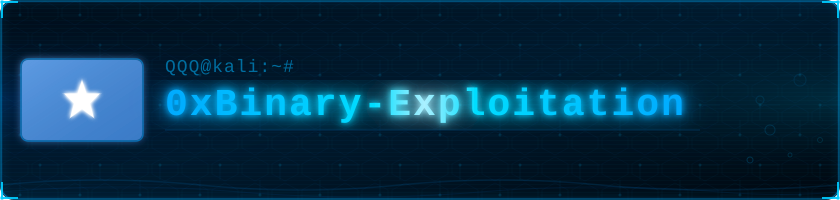

**Assalamu Calaykum!** 
In aad ladan tahay ayaan kuu rajaynayaa, Waxa aan ahay **QQQ** ah arday barta Cilmiga macluumaadka amniga (**Cyber Security**) waliba kasii bartaa waxa quseeya doorka (Role-ka) **Exploit development** halkaas ayaan kuso gaabinaya kuma aan ahay aan oga sii gudubno muhiimada. ina mari!

# Qodob muhiim ah:

Qormadaan iyo kuwa xiga waxa ay gogol-xaar/kasii warbixin u noqon donaan qodobyo udub dhaxaad u ah fahamka **Binary-Exploitation** aynu dhawaan si taxane ah aan ugu soo gudbin doono Github-kaan  

Mooduucyada aan qormadaan iyo kuwa xiga aan oga hadli donno waxa ay kala yihiin sida hoos ku xusan:

**1:Qaab dhismeedka Computer-ka (Computer architecture)**
 * CPU, RAM

**2:Memory Basics**
 * Memory layout (stack, heap, data, iwm)
 * Hexadecimal & addressing 
 * Endianness 

**3:C for Exploitation (Focused)**
 * Pointers 
 * Arrays & strings 
 * Dynamic Memory (malloc, free)
 * Unsafe functions (gets, strcpy etc)

**4:Basic Assembly language**
 * Instructions (push, pop, mov, call) & Registers 
 * Stack frames & Function calls

**5:Buffer overflow**
* Waa maxay Buffer overflow (BOF)
* Waa maxay Stack buffer overflow?
* Waa maxay Heap buffer overflow
* Waa maxay sababta ay luqadaha C iyo C++ ay yihiin kuwa u nugul qatarta amniyeed ee loo garan ogyahay **Buffer overflow?**

# Xasuusin:

Ma ahi Ruux ku takhasusay waxa u rabo in uu idin lawadaago ee waxaan ahay arday ku gudajidha barashadeeda rabana waxa uu soo bartay in uu lasii wadaago dadkiisa, si aawgeed waa hubaal in aad igu arki doontid qald,labo,saddax iyo kasii badan. marka waxaan si naxariis leh aan kaaga codsanaya in aad ila soo wadaagtid wixii qaladaad aad ku aragtid Qoraalada, Lives-ka si aan U saxno.

Horay baa loo yidhi: "Aqoon is-weydaarsi waa hodontinimo aan dhamman"

# Gunaanad:

**Farxad aan lasoo koobi karin ayee ii tahay in dadkaygii aan wax uun ku taro haba yaraadaane.**

**Kun iyo kow jeer ayaad ku mahadsan** tahay aqrinta aad qormadaan ku bixisay, waxaan **Eebe S.W.T** ka baryayaa in cinjo foodeed-ba ha ahaatee wax uun aad ka faaiidid qormooyinka soo socda.  

> sida uu hadda kahor ruux caqli badana ah uu yidhi:"Segmentation fault? it's like an invitation for anyone to exploit" 
